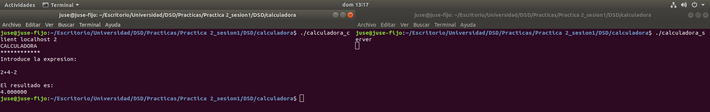
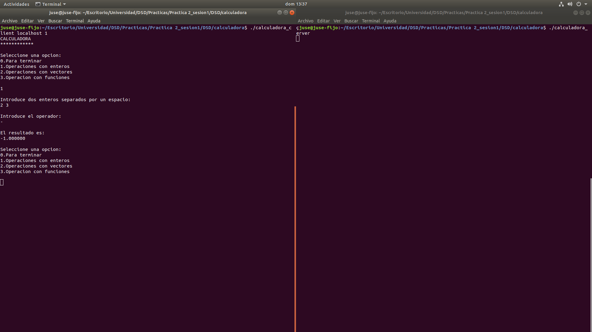
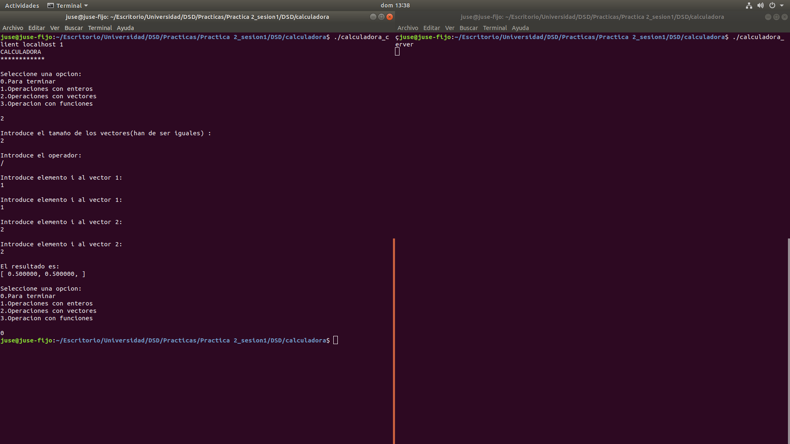
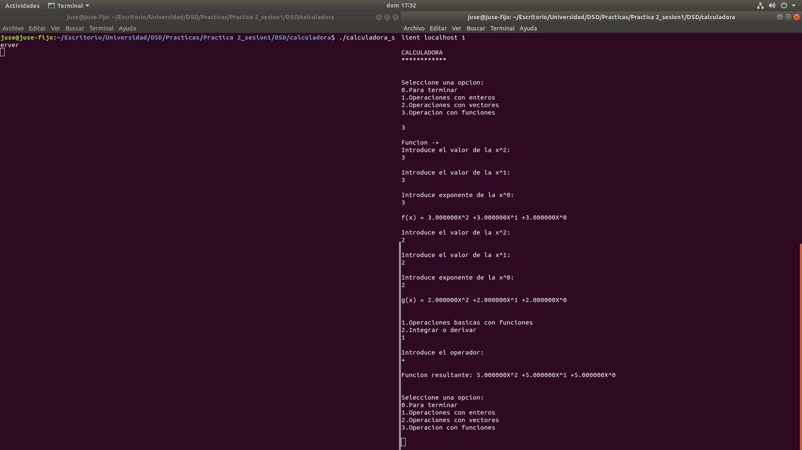
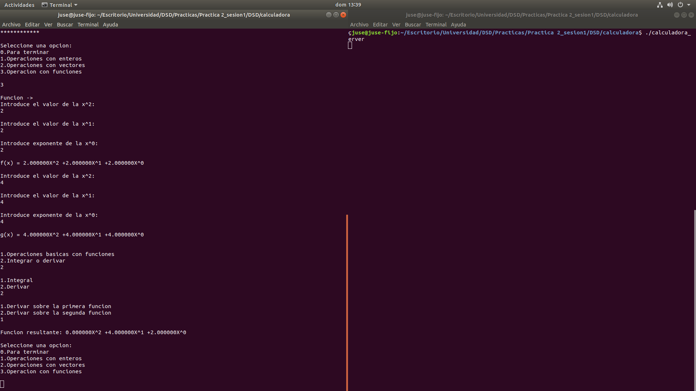

## Memoria Práctica 2: Calculadora Sun RPC   ~ José Santos Salvador
---
### 1. Calculadora básica
La primera parte de la práctica consistía en realizar una calculadora con unas operaciones básicas(sumar, restar, multiplicar y dividir) con dos enteros, siendo el cliente el que pide esa operación, la realiza el servidor y se la envía al cliente.  
Para ello se le pasaba los dos enteros y el operador al ejecutar el cliente,

    if (argc != 5) {
		printf ("usage: %s <server_host> <entero> <operador> <entero>\n", argv[0]);
		exit (1);
	}
	host = argv[1];
	entero1 = atoi(argv[2]);
	operador = (char) argv[3][0];
	entero2 = atoi(argv[4]);
    calprog_1 (host,entero1,operador,entero2);

Modificando un poco el código generado, la función calprog_1 realizaría las operaciones pertinentes según el operador que se le pasa y llamaría a la función en el servidor para realizar la operación.    

    switch (operador)
	{
	case '+':
		result_1 = suma_1(num1, num2, clnt);
		if (result_1 == (double *) NULL) {
			clnt_perror (clnt, "call failed");
		}
		else
		{
			printf("%lf \n", *result_1);
		}
		break;
        //igual con el resto de operaciones y case...    

Función del servidor   

    double *
    suma_1_svc(int arg1, int arg2,  struct svc_req *rqstp)
    {
        static double  result;
        result = arg1 + arg2;
        printf("%d \n",arg1);
        printf("%d \n",arg2);
        printf("%lf \n",result);
        return &result;
    }
    //igual con el resto de operaciones     

Los principales problemas a la hora de realizar estas operaciones básicas fueron el tratamiento del resultado por parte del servidor, que era un puntero, el formato de printf era para mostrar le resultado por pantalla (usando %lf ya que es un double) y la llamada a atoi para leer el operador. También me gustaría añadir que no permito la división entre el número cero [1] y que para obtener el resultado de la división como un double hago esto

		result = (arg1 + 0.0) / arg2;	

### 2. Operaciones con vectores

Tras realizar la calculadora básica, pensé en añadir la funcionalidad de realizar operaciones básicas con vectores de double (para así tener mas posiblidades y no ser unicamente enteros) y me encontré ante el problema de meter los vectores a la calculadora. Decidi pues utilizar printf como modo de mostrar texto al usuario y scanf para leer de la temrinal. 

	if (argc != 2) {
		printf ("usage: %s <server_host>\n", argv[0]);
		exit (1);
	}
	host = argv[1];

	printf("CALCULADORA\n");
	printf("************\n");
	printf("Seleccione una opcion:\n1.Operaciones con enteros\n2.Operaciones con vectores\n\n");
	scanf("%d",&opcion);

Cuando comencé a implementar este especie de "menú", tuve que tener cuidado a la hora de usar scanf, ya que es necesario pasarle el formato y la variable en la que se va a almacenar por referencia. Para operar con los vectores, pido al usuario que introduzca el tamaño (igual para ambos vectores) y los valores unitarios de cada elemento del vector.   
Para implementar el vector, tuve que usar la declaración de array fijos/variables en vez de la de punteros en el archivo .x, con sus respectivas funciones para calcular las operaciones básicas sobre vectores.

	typedef double t_array<>;

	t_array sumaVectores(t_array a, t_array b, int n) = 5;      

Tras usar el .x con esa definición de array, generé con rpcgen -NCa el resto de funciones y las implementé en el archivo servidor.   

	t_array *
	sumavectores_1_svc(t_array a, t_array b, int n,  struct svc_req *rqstp)
	{
	static t_array  result;
	result.t_array_len = n;
	result.t_array_val = malloc(n*sizeof(double));

	for(int i = 0; i < result.t_array_len; i++)
	{
		result.t_array_val[i] = a.t_array_val[i] + b.t_array_val[i];
	}

	return &result;
	}    

Uno de los principales puntos de conflicto en esta parte, fué a la hora de trabajar con los punteros al manejar los vectores, siendo necesario reservar memoria con malloc(usando el tamaño dado por el cliente) y liberada después con free [2]. También hubo errores en los que estaba accediendo al valor del tamaño del struct (que es como lo genera rpcgen) en vez de al puntero de doubles y confusiones entre acceso al struct con punto o a un puntero a ese struct con flecha (->). Añadir que cree una función para mostrar los vectores.   

	typedef struct {
	u_int t_array_len;
	double *t_array_val;
	} t_array;

### 3. Operaciones con funciones

La calculadora también permite hacer calculos de funciones lineales de grado 2 (ax^2 + bx + c), declaradas en el archivo .x como un struct y generada también como un struct en el archivo.c.      

	struct funcion {
	double x;
	int exponente_x;
	double y;
	int exponente_y;
	double z;
	int exponente_z;
	};

Al inicio de su implementación, eran unicamente los valores x, y, z, sin embargo mas tarde decidí implementar la integración y la derivación, necesitando para ello el valor de sus exponentes. Para las operaciones básicas, unicamente hay que acceder a los valores x, y, z de cada función y hacer dicha operación componente a componente, sin variar los exponentes(archivo servidor.c).   

	funcion *
	sumafunciones_1_svc(funcion f1, funcion f2,  struct svc_req *rqstp)
	{	
	static funcion result;

	result.x = f1.x + f2.x;
	result.y = f1.y + f2.y;
	result.z = f1.z + f2.z;

	result.exponente_x = f1.exponente_x;
	result.exponente_y = f1.exponente_y;
	result.exponente_z = f1.exponente_z;

	return &result;
	}

Para la derivación e integración, si hay que modificar el valor de los exponentes, en la derivada unicamente hay que cambiar el valor de z por el de y, el de y por el x * 2 y el de x valdría 0 (es decir si derivas 2x^2 + 2x + 2, se convteriria en 0x^2 + 4x + 2).Todo ello gracias a que es una ecuación lineal de grado 2.

	funcion *
	derivadafunciones_1_svc(funcion f1,  struct svc_req *rqstp)
	{
		static funcion result;

		result.z = f1.y ;
		result.y = f1.x * 2;
		result.x = 0;

		result.exponente_x = f1.exponente_x;
		result.exponente_y = f1.exponente_y;
		result.exponente_z = f1.exponente_z;

		return &result;
	}

Para las integrales hay que sumarle 1 a cada exponente y el valor del exponente + 1 dividirlo entre el valor de cada componente.   

	funcion *
	integralfunciones_1_svc(funcion f1,  struct svc_req *rqstp)
	{
		static funcion  result;

		result.exponente_x = f1.exponente_x + 1;
		result.x = f1.exponente_x / (double) result.exponente_x;

		result.exponente_y = f1.exponente_y + 1;
		result.y = f1.exponente_y / (double) result.exponente_y;

		result.exponente_z = f1.exponente_z + 1;
		result.z = f1.exponente_z / (double) result.exponente_z;

		return &result;
	}

También he creado dos metodos para leer funciones y mostrarlas.

### 4. Operación con expresión

En este punto de la calculadora, añadí otra forma de hacer operaciones, esta vez siendo introducida como una expresión continua (2+2-2). Además quise que no fuera también dentro del menú, si no que separé todas estas operaciones y el introducir una expresión para ser calculada. Al ejecutar el programa se te pide también una opción, siendo el 1 para entrar en el resto de operaciones mediante menú y el 2 para introducir la expresión entera (archivo cliente.c).     

	if (argc != 3) {
		printf ("usage: %s <server_host> <tipo>\n", argv[0]);
		printf ("tipo: 1 = operaciones con interfaz, 2 = operaciones con expresion directa(enteros con 1 digito)\n");
		exit (1);
	}
	host = argv[1];

Siendo una funcionalidad tan simple, fué la parte donde más problemas tuve. A la hora de leer la cadena estuve probando distintas funciones, hasta usar getline. Con ella, consigo leer la expresión introducida por teclado, te devuelve el numero de bytes (que servirá para poder recorrerla) y el puntero de char que le pasas, te lo redimensiona según lo que lee, siendo una de las opciones más seguras a la hora de leer cadenas. 

	if(atoi(argv[2]) == 2)
	{
		int numero_bytes = 0;
		char *cadena = NULL;

		puts("Introduce la expresion:\n");

		numero_bytes = getline(&cadena, &numero_bytes, stdin);

		if (numero_bytes != -1)
		{
			calcular_expresion(host,cadena,numero_bytes);
		}
	}

Esa cadena se le pasa al servidor que es el que realiza la operación y devuelve un double con el resultado. Es este el que se encarga de recorrer la cadena para buscar tanto los números como los operadores y son almacenados en sus respectivos punteros (numeros[], operadores[])  

		//fragmento de lo que sería esa función

		for(int i=0;i<n;i++)
		{
			if(formula[i] == '+')
			{
				operadores[tam_operadores] = formula[i];
				tam_operadores++;
			}
			else
			{
				c[0] = formula[i];
				int valor = atoi(c);
				numeros[tam_numeros] = valor;
				tam_numeros++;
			}

Tras eso, se recorre los operadores y los números y se van realizando las operaciones necesarias.   
En este punto tuve muchisimos impedimentos a la hora de leer la cadena, identificar si era número (convertir con atoi) u operador y realizar las operaciones para que se realizaran de forma correcta y que el resultado de la primera operacion, se usara para la segunda y consecutivas operaciones.   
Tanto es así que mi funcionalidad, solo permite operar con números que tengan una cifra, estuve intentando hacerlo con números de cifras más altas pero era una chapuza y lo acabé descartando [3]. Adicionalmente se podría haber hecho también leyendo la expresión desde un fichero con:  

		//para hacerlo de un archivo seria coger esa cadena y mirar si el primer char es un . de ./ y entonces haces:

		FILE *fp, fp = fopen(cadena,"r")

### 5. Funcionamiento del programa

El programa tras haber revisado todo lo que hace, brinda la posibilidad de hacer las cosas desde un menu o introduciendo al expresión en la ejecución del mismo.[4]   

Introduciendo la expresión:

Usando el menú:

1) Operaciones básicas

2) Operaciones con vectores

3) Operaciones con funciones

### 6. Conclusion

El uso de herramientas de llamadas remotas a procedimientos (RPC) permite crear múltiples herramientas ocultando detalles de los mecanismo de red subyacentes. Crear una función en los archivos .x y generar los archivos en c necesarios para trabajar, dotando así al sistema de una capacidad enorme. Sin embargo, he tenido algunos punto de los que me gustaría hablar. A lo largo de la práctica, me he visto en un continua tira y afloja con C y los punteros, siendo así ya que el propio rpcgen te genera la respuesta de sus funciones servidor como punteros a esos datos o estrucutras, por tanto veo un punto flojo o tal vez problemático, la limitación de generarlo en C. Traté también de realiar una función que al pasarle una expresión, me devolviese mediante el uso de la estructura t_bool si era o no correcta, para ello reutilizaba el código que uso al calcular la expresión, modificando que al encontrar '=', calculase la expresión de la izquierda y la comparase con el valor de la derecha (2+2 = 4). Sin embargo al usar t_bool y compilar, tuve numerosos errores. Conectando con esto, me ha resultado tedioso el makefile que te generaba por defecto. Tanto es así que también intenté crear un sevidor que también fuese cliente, sin mucha suerte por cierto. Introducía el código del cliente dentro del servidor, en la llamada pero al compilar también me devolvian numerosos errores que intenté subsanar (como la refinición) pero que descarté por falta de tiempo.    
Es por tanto una herramienta que me parece super útil, versatil e interesante pero que como todo, hace falta tiempo para entender y dominar al completo.

[1]: En el resto de operaciones no he considerado que el usuario pueda introducir una división entre cero, ya que son operaciones algo mas complejas.   
[2]: Hubo muchisimos segmentation fault, core dumped y demás que creía olvidados de mi travesía con C++, eche de menos el uso de la stl, hubiese facilitado bastante la mayoría de cosas y brindado la posibilidad de hacerlo de una forma mas rigurosa.   
[3]: Si se mete desde la ejecuión del programa, hubiese sido muy fácil, pero ya tenía el menú y el resto de cosas.   
[4]: Todas las imagenes están en el zip con el resto de archivos.