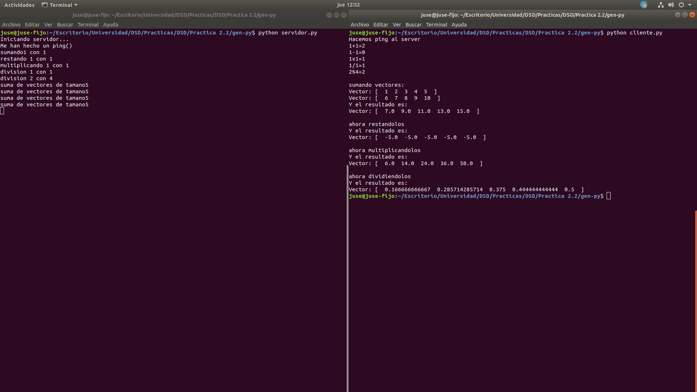
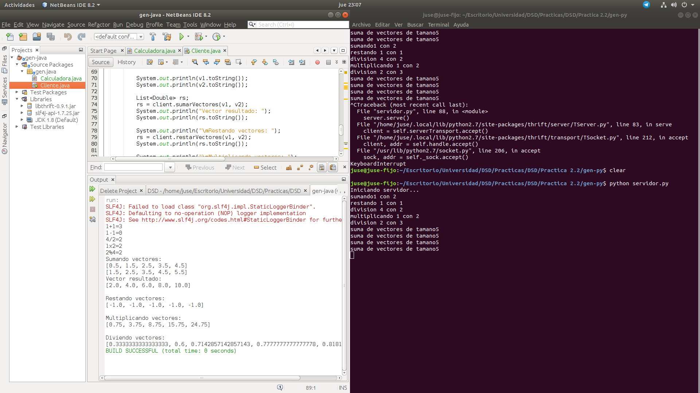
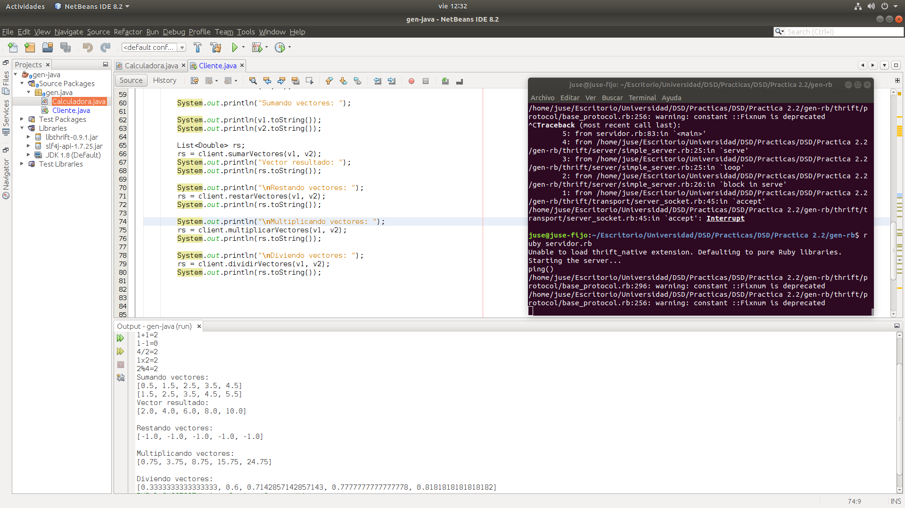
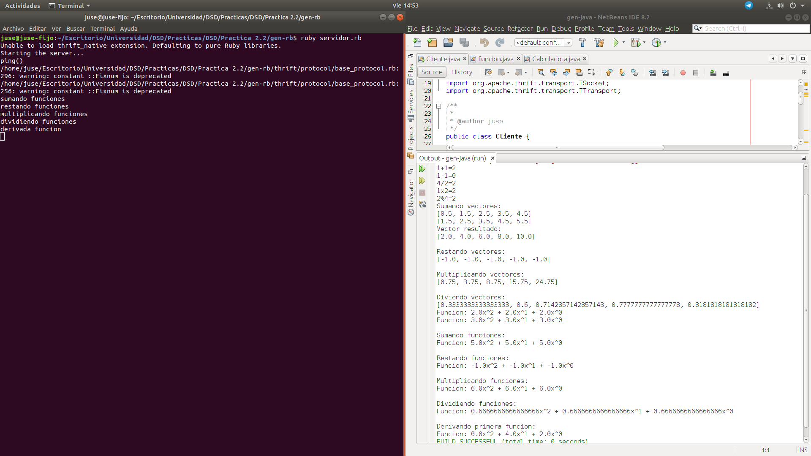
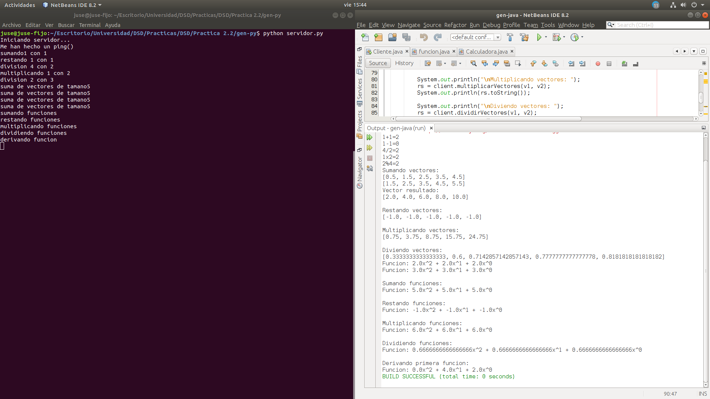
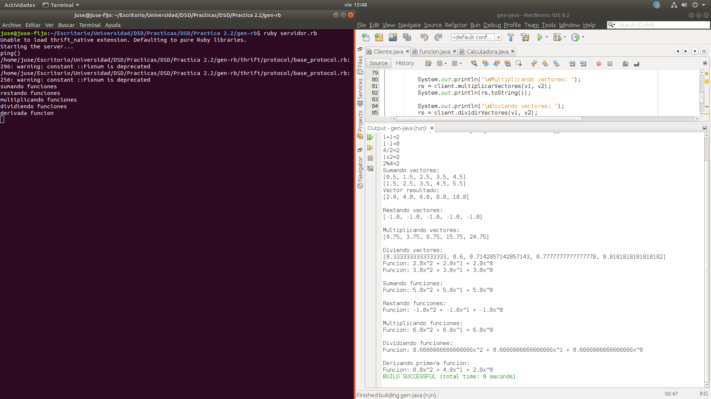
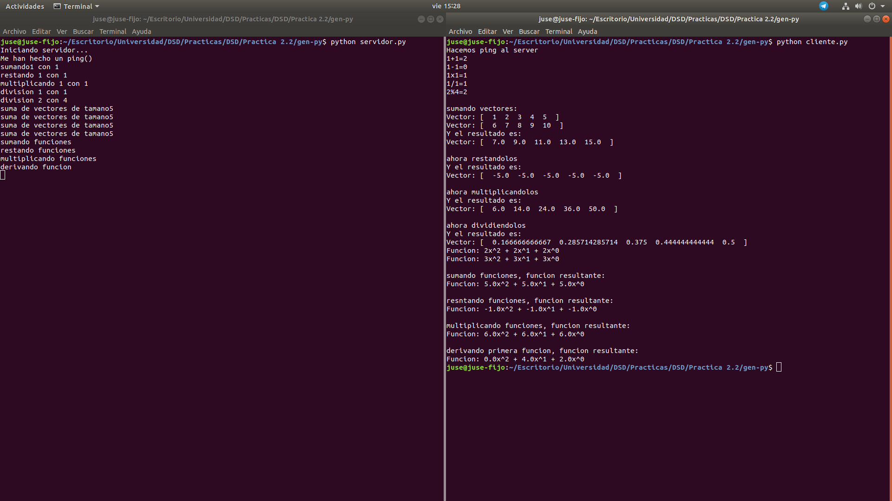
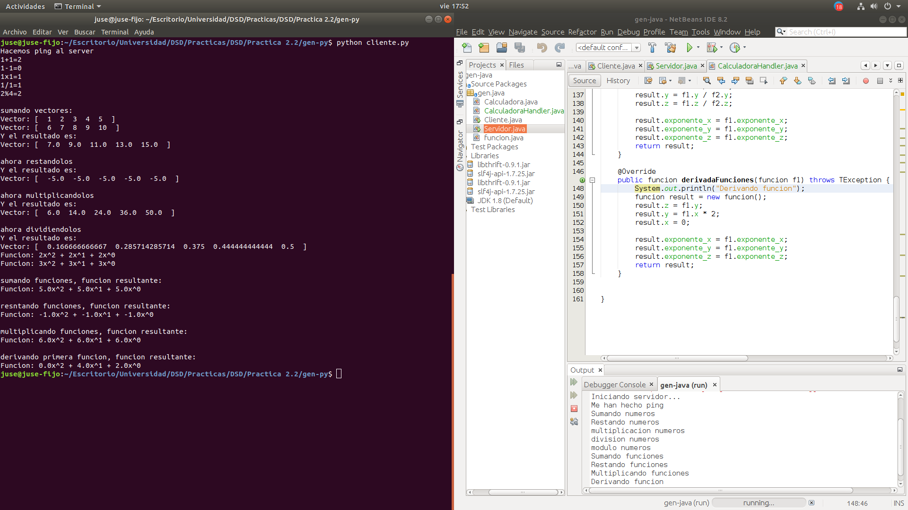
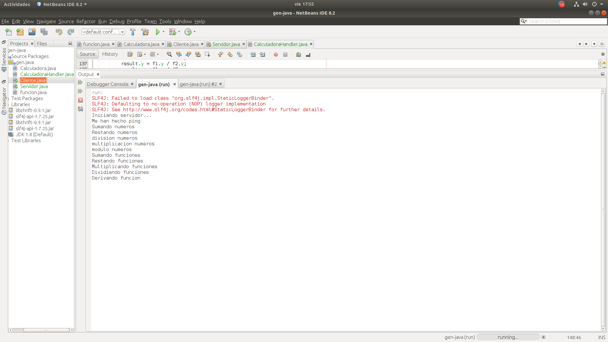
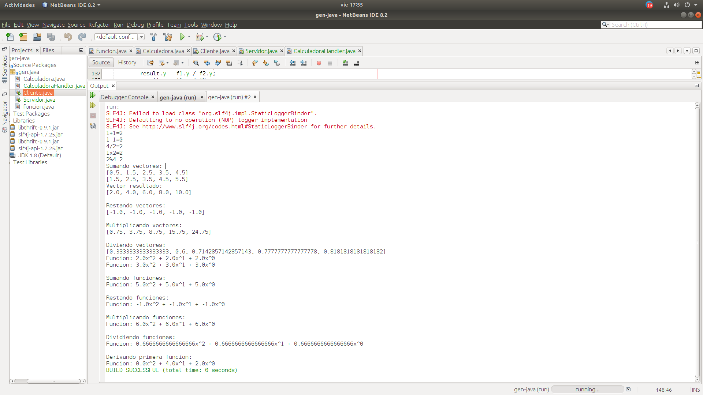

## Memoria Práctica 2.2: Calculadora Thrift     ~        José Santos Salvador
---   
### 1.Calculadora básica 
La primera parte consistía en una calculadora capaz de realizar unas operaciones básicas (a las que le añadi el módulo). Para ello, primero se crea un archivo calculadora.thrift con las funciones que va a implementar el servidor que implementé en python.     

    service Calculadora{
        void ping(),
        i32 suma(1:i32 num1, 2:i32 num2),
        i32 resta(1:i32 num1, 2:i32 num2),
        i32 multiplicacion(1:i32 num1, 2:i32 num2),
        i32 division(1:i32 num1, 2:i32 num2),
        i32 modulo(1:i32 num1, 2:i32 num2),
    }

Para generar los archivos se ejecuta thrift señalando que van a ser en python.

    thrift -gen py calculadora.thrift

En esta práctica hay que tener en cuenta la diferencia entre el compilador de thrift (sentencia de arriba) que hay que instalar y las librerías o paquetes particulares de cada lenguaje (en python se puede con el gestor de paquetes pip)

    python -m pip install thrift

Tras generar los archivos, implementé las funciones en el servidor 

        def suma(self,n1,n2):
        print('sumando'+str(n1)+" con "+str(n2))
        return n1+n2

           ...

        def modulo(self,n1,n2):
        print('division '+str(n1)+ " con "+str(n2))
        return n1 % n2

Y las llamé desde el cliente tras crear la conexión con el servidor (ambos archivos han de ser creados manualmente)

    transport = TSocket.TSocket('localhost',9090)
    transport = TTransport.TBufferedTransport(transport)
    protocol = TBinaryProtocol.TBinaryProtocol(transport)
    #creamos el cliente
    client = Calculadora.Client(protocol)    

    resultado = client.suma(1, 1)
    print("1+1="+str(resultado))
            ...
    resultado = client.modulo(2, 4)
    print("2%4="+str(resultado))   

Los problemas que me encontré en esta parte fueron algunos errores con la versión de python 3.6 y que puede arreglar usando la versión 2.7.

## 2.Operaciones con vectores
Para realizar la implementación de operaciones con vectores declaré las funciones en calculadora.thrift como list<double>

    	list<double> sumarVectores(1:list<double> v1, 2:list<double> v2)

y la implementación en el servidor consiste en recorrer cada componente de los vectores y realizar la operación pertinente, el resultado de esa operación se guarda en un vector con append que devuelve la función al terminar.

        def sumarVectores(self,v1,v2):
        print('suma de vectores de tamano'+str(len(v1)))
        v3 = list()
        for i in range(0,len(v1)):
            v3.append(v1[i]+v2[i])
        return v3

El cliente llama a la función del servidor y almacena el vector resultante (cree una función para poder mostrar los vectores de una forma mas ordenada)

    def mostrarVector(resultado):
    salida = "Vector: [ "
    for i in range(0,len(resultado)):
        salida = salida + " " + str(resultado[i]) + " "
    salida = salida +  " ]"
    print(salida)

    v1 = [1,2,3,4,5]
    v2 = [6,7,8,9,10]

    print("\nsumando vectores: ")
    mostrarVector(v1)
    mostrarVector(v2)
    resultado = client.sumarVectores(v1,v2)
    print("Y el resultado es: ")
    mostrarVector(resultado)

En este punto de la práctica y sin tener ningún conocimiento de python, tuve que buscar la forma en que se implementaban los array, la forma de recorrerlos, usar bucles y almacenarlos. Uno de los problemas que tuve fué que no conseguía almacenar el resultado de la suma de dos vectore en el vector resultado, para ello tuve que declararlo como v3 = list() y usar append(valor). Cuando lo tenía todo terminado, al ejecutarlo me daba un error, fruto de que declaraba la función de mostrar el vector después, acostumbrado a lenguajes compilados.

## 3.Implementación cliente y servidor en Java  

Para implementar el servidor en Java me hizo falta usar netbeans y desde ahí cargar dos archivos .jar, libthrift-0.9.1.jar y slf4j-api-1.7.25.jar. Tras generar Calculadora.java con thrift, me dieron errores debido a que usaba un archivo .jar de thrift para una versión distinta a la que tenía de thrift. Tras implementar el servidor en Java(había que cambiar ciertas cosas de lo puesto en el pdf)

    class Servidor{
    public static void main(String args[]){
        CalculadoraHandler handler = new CalculadoraHandler();
        Processor processor = new Processor(handler);
        try{
            TServerTransport serverTransport = new TServerSocket(9090);
            TServer server = new TSimpleServer(new Args((TNonblockingServerTransport) serverTransport).processor(processor));
            
            System.out.println("Iniciando servidor...");
            server.serve();
        }catch (Exception e){e.printStackTrace();}
    }
    }

Me dio el siguiente error

    SLF4J: Failed to load class "org.slf4j.impl.StaticLoggerBinder".
    SLF4J: Defaulting to no-operation (NOP) logger implementation

Tras eso el profesor, me resolvío el problema y era debido a que no creaba de forma correcta el servidor, teniendo que crearlo como 

          TServer server = new TSimpleServer(new Args(serverTransport).processor(processor));

y también me faltaba importar Args como org.apache.thrift.server.TServer.Args
        

    class Servidor{
    public static void main(String args[]){
        CalculadoraHandler handler = new CalculadoraHandler();
        Processor processor = new Processor(handler);
        try{
            TServerTransport serverTransport = new TServerSocket(9090);
            TServer server = new TSimpleServer(new Args(serverTransport).processor(processor));
            
            System.out.println("Iniciando servidor...");
            server.serve();
        }catch (Exception e){e.printStackTrace();}
    }
    }

También implementé el cliente.

    public class Cliente {
        public static void main(String args[]){
    try {
      TTransport transport;
     
      transport = new TSocket("localhost", 9090);
      transport.open();

      TProtocol protocol = new  TBinaryProtocol(transport);
        Calculadora.Client client = new Calculadora.Client(protocol);
        double resultado = client.suma(1, 2);
        System.out.println("El resultado es: "+resultado);
                    .....

        ArrayList<Double> v1 = new ArrayList<>();
        ArrayList<Double> v2 = new ArrayList<>();
        inicializarVectores(v1,v2);
        
        System.out.println("Sumando vectores: ");

        System.out.println(v1.toString());
        System.out.println(v2.toString());

        List<Double> rs;
        rs = client.sumarVectores(v1, v2);
        System.out.println("Vector resultado: ");
        System.out.println(rs.toString());            
      

      transport.close();
    } catch (Exception e){e.printStackTrace();}
    }
    }

Terminé de implementar todas las llamadas al servidor que tenia en cliente de python pero en java. Todo esto permite realizar las llamdas desde un cliente java al servidor en python de forma correcta. Para lanzar el servidor o cliente de forma individual en netbeans es necesario seleccionar el archivo, boton derecho y run file.

## 4.Implementación servidor en Ruby  
Tras el intento fallido del servidor en Java, implementé el servidor en Ruby, usando manualmente la libreria de thrift en el proyecto (se puede ver en el zip que he enviado).

    class CalculadoraHandler
    def initialize()
        @log = {}
    end

    def ping()
        puts "ping()"
    end

    def suma(num1, num2)
        return num1 + num2
    end

           ...

        def sumarVectores(v1, v2)
            valor = v1.length - 1
            v3 = Array.new(valor)
            for i in 0..valor
            v3[i] = v1[i] + v2[i]
            end
            return v3
        end
              ....
    end
    end

    handler = CalculadoraHandler.new()
    processor = Calculadora::Processor.new(handler)
    transport = Thrift::ServerSocket.new('127.0.0.1',9090)
    transportFactory = Thrift::BufferedTransportFactory.new()
    server = Thrift::SimpleServer.new(processor, transport, transportFactory)

    puts "Starting the server..."
    server.serve()
    puts "done."

Tuve algún problema a la hora de devolver el vector resultado tras realizar las operaciones con ruby, ya que lo declaraba como Array.new. Para solucionar, lo declaré como Array.new(v1.length - 1).

## 5.Implementación operaciones adicionales 

Añadí la capacidad de realizar operaciones básicas con funciones lineales de grado 2 y derivadas. Par ello primero declaré los métodos en el archivo thrift y el struct de la funcion.

    struct funcion{
	1: required double x;
	2: required i32 exponente_x;
	3: required double y;
	4: required i32 exponente_y;
	5: required double z;
	6: required i32 exponente_z;
    }

    service Calculadora{
            ....
        funcion sumaFunciones(1:funcion f1, 2:funcion f2),
             ...
        funcion derivadaFunciones(1:funcion f1),
    }

Tras esto, tuve que generar otra vez los archivos en los distintos lenguajes (Ruby, Python y Java) e implementarlos. 

        def sumaFunciones(self,f1,f2):
        print("sumando funciones")
        result = funcion(0,0,0,0,0,0)
        result.x = f1.x + f2.x
        result.y = f1.y + f2.y
        result.z = f1.z + f2.z

        result.exponente_x = f1.exponente_x
        result.exponente_y = f1.exponente_y
        result.exponente_z = f1.exponente_z
        return result
                ....

El codigo es similar entre el servidor de Python (fragmento de arriba) y el servidor de Ruby, la diferencia reside en que para declarar una funcion en Python se hace como 

    result = funcion(0,0,0,0,0,0)

mientras que en ruby es 

        result = Funcion.new

Cabe destacar que es necesario hacer un import en Python del archivo ttype donde se genera el "struct"

    from calculadora.ttypes import funcion

mientras que en Ruby hay que usar
 
     require 'calculadora_types'

En java se te genera un archivo con funcion y hay que meterlo dentro del paquete en el que estamos trabajando.
Finalmente implementé las llamadas a los servidores en ruby y python desde los clientes en java y python.

    """ han de ser de grado 2 """
    f1 = funcion(2,2,2,1,2,0)
    f2 = funcion(3,2,3,1,3,0)
    mostrarFuncion(f1)
    mostrarFuncion(f2)

    print("\nsumando funciones, funcion resultante: ")
    f3 = client.sumaFunciones(f1,f2)
    mostrarFuncion(f3)

Arriba en python, abajo en java.

    funcion f1 = new funcion(2,2,2,1,2,0);
        funcion f2 = new funcion(3,2,3,1,3,0);
        funcion f3 = new funcion(0,0,0,0,0,0);
        mostrarFuncion(f1);
        mostrarFuncion(f2);
        
        System.out.println("\nSumando funciones: ");
        f3 = client.sumaFunciones(f1, f2);
        mostrarFuncion(f3);

## 6.Funcionamiento del programa
El programa consta de un servidor/cliente en python, un cliente en java y un servidor en ruby. Se pueden realizar operaciones básicas sobre números, sobre vectores y funciones (creadas mediante un struct en el archivo thrift). Las posiblidades que ofrece dentro de estas operaciones son:     
1. Servidor python y cliente python (carpeta gen-py)      

2. Servidor python (carpeta gen-py) y cliente java (carpeta gen-java)

3. Servidor ruby (carpeta gen-rb) y cliente java

4. Servidor ruby y cliente en python

5. Servidor java y cliente en python

6. Servidor java y cliente en java

             
## 7.Conclusiones

En esta práctica se hace uso de Apache Thrift para realizar una calculadora básica, se debe diferencia entre el compilador y las librerias especificas de cada lenguaje. Ha supuesto una mejora respecto a RPC Sun, ya que al añadir nuevas funciones al archivo thrift, no tenia que copiar el código en otra parte, generar el .x y volver a copiar el código. Con Thrift unicamente se genera otra vez calculadora y es en el servidor y cliente donde implementas y llamas a esos nuevos métodos. Sin embargo también me he encontrado con algunos conflictos a la hora de usar las librerias de cada lenguaje, con java tuve que usar Netbeans y cargar los .jar compilados de internet, aún con todo me seguía dando error (estuve buscando sobre Maven y hubiese sido una mejor opción) y con ruby no conseguí instalar thrift desde el gestor de paquetes gem y tuve que hacerlo de forma manual copiando la libreria sobre el proyecto de ruby.  
En esta práctica me he querido centrar en las comunicaciones entre distintos servidores y clientes en diferentes lenguajes de programación sobre datos mas sencillos como enteros y doubles, hasta estructura algo más complejas como vectores y funciones.    
Con Thrift he podido realizar practicamente lo mismo que con RPC Sun de una forma mas versatil y ágil, he aprendido a tratar de forma básica con Python y las comunicaciones entre distintos lenguajes mediante cliente y servidor, aunque sigue presentando alguna limitación similar a RPC Sun a la hora de tratar con estrucuturas complejas.  
