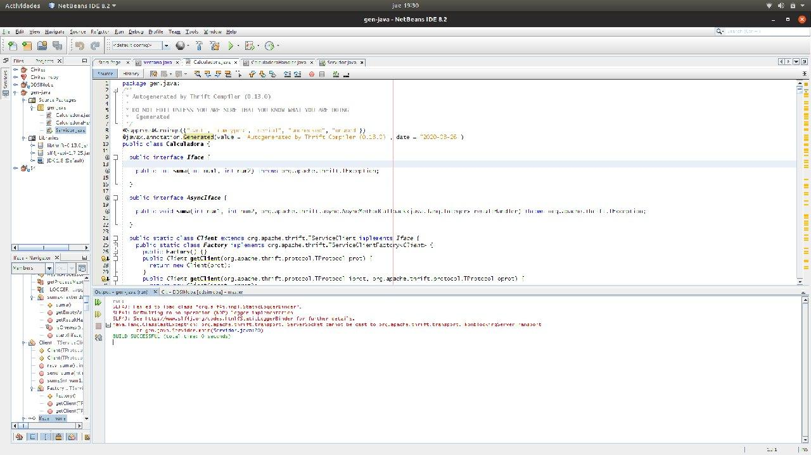

## Memoria Práctica 2.2: Calculadora Thrift
---   
### 1.Calculadora básica 
La primera parte consistía en una calculadora capaz de realizar unas operaciones básicas (a las que le añadi el módulo). Para ello, primero se crea un archivo calculadora.thrift con las funciones que va a implementar el servidor que implementé en python.     

    service Calculadora{
        void ping(),
        i32 suma(1:i32 num1, 2:i32 num2),
        i32 resta(1:i32 num1, 2:i32 num2),
        i32 multiplicacion(1:i32 num1, 2:i32 num2),
        i32 division(1:i32 num1, 2:i32 num2),
        i32 modulo(1:i32 num1, 2:i32 num2),
    }

Para generar los archivos se ejecuta thrift señalando que van a ser en python.

    thrift -gen py calculadora.thrift

En esta práctica hay que tener en cuenta la diferencia entre el compilador de thrift (sentencia de arriba) que hay que instalar y las librerías o paquetes particulares de cada lenguaje (en python se puede con el gestor de paquetes pip)

    python -m pip install thrift

Tras generar los archivos, implementé las funciones en el servidor 

        def suma(self,n1,n2):
        print('sumando'+str(n1)+" con "+str(n2))
        return n1+n2

           ...

        def modulo(self,n1,n2):
        print('division '+str(n1)+ " con "+str(n2))
        return n1 % n2

Y las llamé desde el cliente tras crear la conexión con el servidor (ambos archivos han de ser creados manualmente)

    transport = TSocket.TSocket('localhost',9090)
    transport = TTransport.TBufferedTransport(transport)
    protocol = TBinaryProtocol.TBinaryProtocol(transport)
    #creamos el cliente
    client = Calculadora.Client(protocol)    

    resultado = client.suma(1, 1)
    print("1+1="+str(resultado))
            ...
    resultado = client.modulo(2, 4)
    print("2%4="+str(resultado))   

Los problemas que me encontré en esta parte fueron algunos errores con la versión de python 3.6 y que puede arreglar usando la versión 2.7.

## 2.Operaciones con vectores
Para realizar la implementación de operaciones con vectores declaré las funciones en calculadora.thrift como list<double>

    	list<double> sumarVectores(1:list<double> v1, 2:list<double> v2)

y la implementación en el servidor consiste en recorrer cada componente de los vectores y realizar la operación pertinente, el resultado de esa operación se guarda en un vector con append que devuelve la función al terminar.

        def sumarVectores(self,v1,v2):
        print('suma de vectores de tamano'+str(len(v1)))
        v3 = list()
        for i in range(0,len(v1)):
            v3.append(v1[i]+v2[i])
        return v3

El cliente llama a la función del servidor y almacena el vector resultante (cree una función para poder mostrar los vectores de una forma mas ordenada)

    def mostrarVector(resultado):
    salida = "Vector: [ "
    for i in range(0,len(resultado)):
        salida = salida + " " + str(resultado[i]) + " "
    salida = salida +  " ]"
    print(salida)

    v1 = [1,2,3,4,5]
    v2 = [6,7,8,9,10]

    print("\nsumando vectores: ")
    mostrarVector(v1)
    mostrarVector(v2)
    resultado = client.sumarVectores(v1,v2)
    print("Y el resultado es: ")
    mostrarVector(resultado)

En este punto de la práctica y sin tener ningún conocimiento de python, tuve que buscar la forma en que se implementaban los array, la forma de recorrerlos, usar bucles y almacenarlos. Uno de los problemas que tuve fué que no conseguía almacenar el resultado de la suma de dos vectore en el vector resultado, para ello tuve que declararlo como v3 = list() y usar append(valor). Cuando lo tenía todo terminado, al ejecutarlo me daba un error, fruto de que declaraba la función de mostrar el vector después, acostumbrado a lenguajes compilados.

## 3.Implementación servidor/cliente en Java  

Para implementar el servidor en Java me hizo falta usar netbeans y desde ahí cargar dos archivos .jar, libthrift-0.9.1.jar y slf4j-api-1.7.25.jar. Tras generar Calculadora.java con thrift, me dieron errores debido a que usaba un archivo .jar de thrift para una versión distinta a la que tenía de thrift. Tras implementar el servidor en Java(había que cambiar ciertas cosas de lo puesto en el pdf)

    class Servidor{
    public static void main(String args[]){
        CalculadoraHandler handler = new CalculadoraHandler();
        Processor processor = new Processor(handler);
        try{
            TServerTransport serverTransport = new TServerSocket(9090);
            TServer server = new TSimpleServer(new Args((TNonblockingServerTransport) serverTransport).processor(processor));
            
            System.out.println("Iniciando servidor...");
            server.serve();
        }catch (Exception e){e.printStackTrace();}
    }
    }

Me dio el siguiente error

    SLF4J: Failed to load class "org.slf4j.impl.StaticLoggerBinder".
    SLF4J: Defaulting to no-operation (NOP) logger implementation

Y tras cambiar el archivo .jar a la versión 1.7.25 continuo dandomelo, imposibilitandome seguir la implementación en java. Probé también a utilizar la versión 0.13 de thrift con su respectivo .jar pero seguia dando el mismo error.
.   
Probe a cambiar el código del servidor por si eso era el problema
        

        public class Servidor {

        public static CalculadoraHandler handler;

        public static Calculadora.Processor processor;

        public static void main(String [] args) {
            try {
            handler = new CalculadoraHandler();
            processor = new Calculadora.Processor(handler);

            Runnable simple = new Runnable() {
                public void run() {
                simple(processor);
                }
            };      
            
            new Thread(simple).start();
            } catch (Exception x) {
            x.printStackTrace();
            }
        }

        public static void simple(Calculadora.Processor processor) {
            try {
            TServerTransport serverTransport = new TServerSocket(9090);
            TServer server = new TSimpleServer(new Args(serverTransport).processor(processor));

            System.out.println("Starting the simple server...");
            server.serve();
            } catch (Exception e) {
            e.printStackTrace();
            }
        }
        }

pero el problema persistia y decidí hacer en java unicamente el cliente. 

    public class Cliente {
        public static void main(String args[]){
    try {
      TTransport transport;
     
      transport = new TSocket("localhost", 9090);
      transport.open();

      TProtocol protocol = new  TBinaryProtocol(transport);
        Calculadora.Client client = new Calculadora.Client(protocol);
        double resultado = client.suma(1, 2);
        System.out.println("El resultado es: "+resultado);
                    .....

        ArrayList<Double> v1 = new ArrayList<>();
        ArrayList<Double> v2 = new ArrayList<>();
        inicializarVectores(v1,v2);
        
        System.out.println("Sumando vectores: ");

        System.out.println(v1.toString());
        System.out.println(v2.toString());

        List<Double> rs;
        rs = client.sumarVectores(v1, v2);
        System.out.println("Vector resultado: ");
        System.out.println(rs.toString());            
      

      transport.close();
    } catch (Exception e){e.printStackTrace();}
    }
    }

Aunque el error me seguia saliendo por pantalla, se hace de forma correcta el ping al servidor y mostraba de forma correcta el resultado de la suma. Por lo tanto, terminé de implementar todas las llamadas al servidor que tenia en cliente de python pero en java. Todo esto permite realizar las llamdas desde un cliente java al servidor en python de forma correcta.

## 4.Implementación servidor en Ruby  
Tras el intento fallido del servidor en Java, implementé el servidor en Ruby, usando manualmente la libreria de thrift en el proyecto (se puede ver en el zip que he enviado).

    class CalculadoraHandler
    def initialize()
        @log = {}
    end

    def ping()
        puts "ping()"
    end

    def suma(num1, num2)
        return num1 + num2
    end

           ...

        def sumarVectores(v1, v2)
            valor = v1.length - 1
            v3 = Array.new(valor)
            for i in 0..valor
            v3[i] = v1[i] + v2[i]
            end
            return v3
        end
              ....
    end
    end

    handler = CalculadoraHandler.new()
    processor = Calculadora::Processor.new(handler)
    transport = Thrift::ServerSocket.new('127.0.0.1',9090)
    transportFactory = Thrift::BufferedTransportFactory.new()
    server = Thrift::SimpleServer.new(processor, transport, transportFactory)

    puts "Starting the server..."
    server.serve()
    puts "done."

Tuve algún problema a la hora de devolver el vector resultado tras realizar las operaciones con ruby, ya que lo declaraba como Array.new. Para solucionar, lo declaré como Array.new(v1.length - 1).

## 5.Implementación operaciones adicionales 

en esta practica me he querido centrar mas bien en crear distintos servidores y clientes que no tanto funcionalidades de la calculadora
explicar por algun lado que este mejora los fallos del anterior, no te obliga a C, no te pone punteros por defecto y tu tienes que implementar y crear servidor y cliente, 
problemas a la hora de usar el .jar de la verdsion dsititnas del thrift

enseñar y decir todos los servidore y clientes que tengo y que permito conexiones entre ellos,
mejor que el otro que al generar nuevos ficheros no se te borran clientes y servidores

hacer un utlimo punto explicando como se lanza todo, uno con netbeans y el otro no

EL PROBLEMA DE VERSIONES ENTRE SI FUE UNA PEJIGUERA CON JAVA, estuve mirando y lo mejor hubiese sido usar maven tal y como dijo el profe

problema con ruby por el tema de los array

captura pantalla problema con s4ltf y servidor java
tendrí que haber usado maven