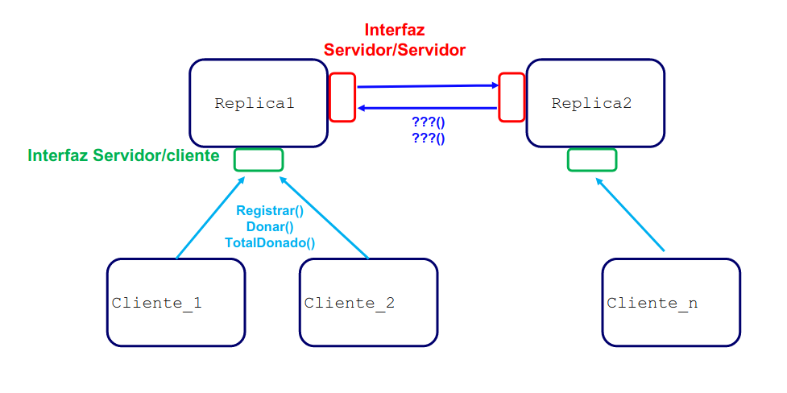
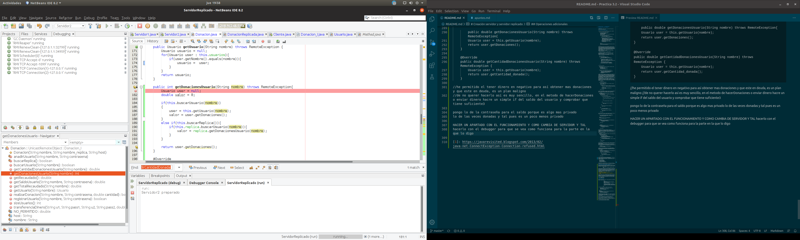
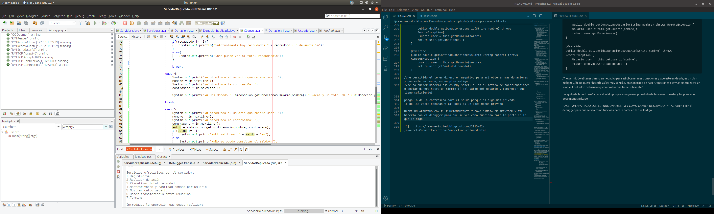
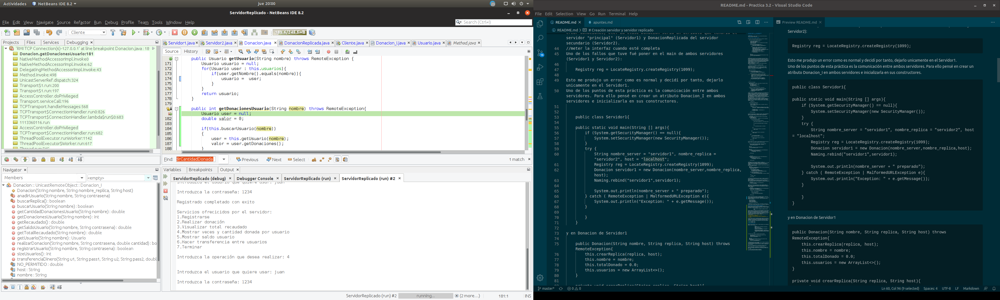
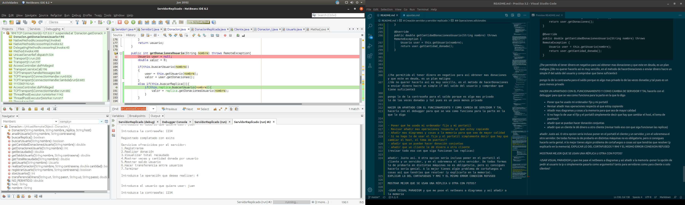
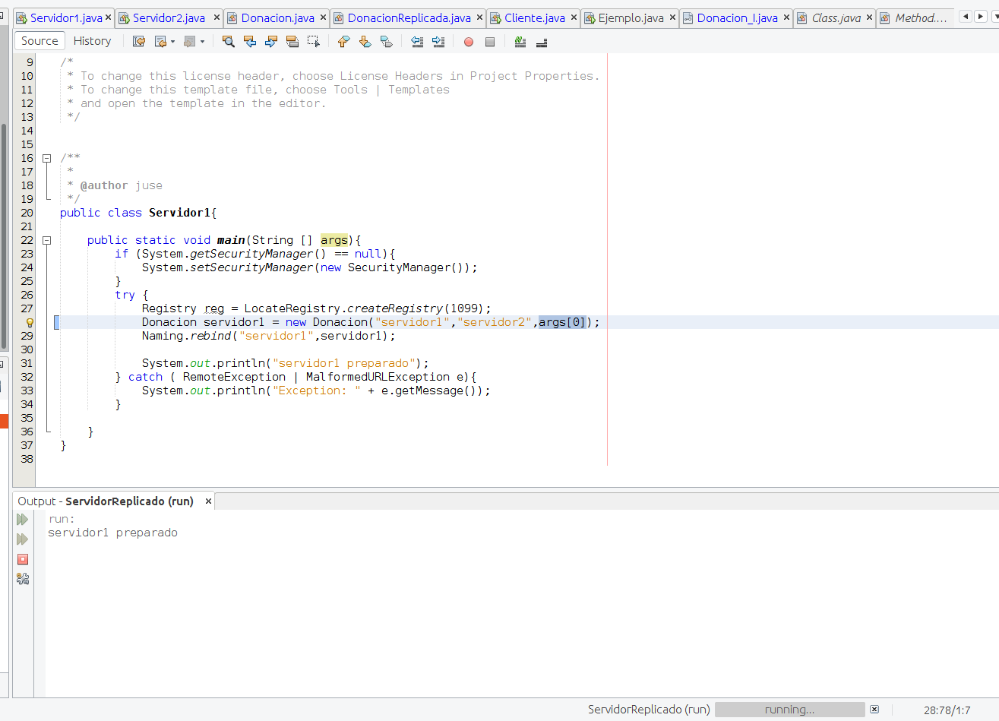
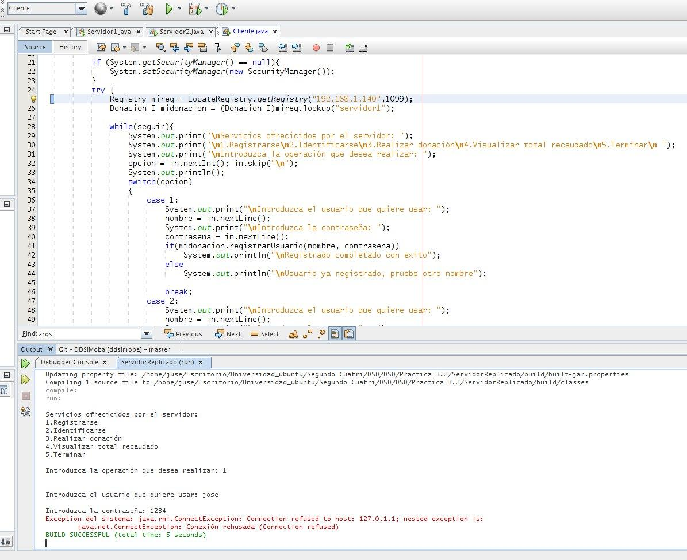
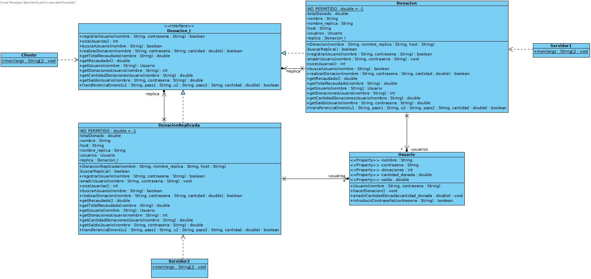

# Práctica 3.2: RMI    ~     José Santos Salvador
## Creación servidor replicado y donaciones.

# Introducción
Tras haber realizado la práctica 3.1 y haberme familiarizado con RMI, en este práctica tenemos que implementar un servicio de donaciones mediante dos servidores. Dichos servidores han de ser invisibles para el usuario e intentarmente nos encargaremos de usar un servidor u otro.

# Creación servidor y servidor replicado

En un inicio cree una primera versión algo básica similar al ejemplo 2

    public class Servidor1 implements Servidor_I{

        private ArrayList<Usuario> usuarios;
        private double totalDonado;
        private String nombre;
        private String replica; //creo una instancia del otro servidor
        private String host;

        public static void main(String[] args) {
            if (System.getSecurityManager() == null){
                System.setSecurityManager(new SecurityManager());
            }
            try{
                Servidor_I prueba = new Servidor1();
                Servidor_I stub = (Servidor_I) UnicastRemoteObject.exportObject(prueba,0);
                Registry registry = LocateRegistry.getRegistry();
                String nombre_objeto_remote = "un_nombre_para_obj_remoto";
                registry.rebind(nombre_objeto_remote, stub);
                System.out.println("Servidor1 bound");
            }catch (Exception e){
                System.err.println("Servidor1 exception:");
                e.printStackTrace();
            }
        }

        @Override
        public synchronized void registrarUsuario(String usuario, String contrasena) throws RemoteException {
                    ... 
        }
    }

acabe desechando esta opción, ya que me obligaba a tener una serie de atributos en el servidor y métodos (respecto a las donaciones), mezclando así las responsabilidades de las clases. Decidí hacerlo más similar al ejemplo 3, creando una interfaz Donacion_I y dos clases concretas Donacion y DonacionReplicada donde meter las funcionalidades de registrar usuarios, crear donaciones, etc. La clase Donacion sería un atributo que tendría el servidor "principal" (Servidor1) y DonacionReplicada del servidor secundario (Servidor2).
//meter la interfaz cuando esté completa
Uno de los fallos que tuve fué poner en el main de ambos servidores (Servidor1 y Servidor2):

    Registry reg = LocateRegistry.createRegistry(1099);

Esto me produjo un error como es normal y decidí por tanto, dejarlo unicamente en el Servidor1.   
Uno de los puntos de esta práctica es la comunicación entre ambos servidores. Para ello pensé en crear un atributo Donacion_I en ambos servidores e inicializarla en sus constructores.

    public class Servidor1{

    public static void main(String [] args){
        if (System.getSecurityManager() == null){
            System.setSecurityManager(new SecurityManager());
        }
        try {
            String nombre_server = "servidor1", nombre_replica = "servidor2", host = "localhost";
            Registry reg = LocateRegistry.createRegistry(1099);
            Donacion servidor1 = new Donacion(nombre_server,nombre_replica,host);
            Naming.rebind("servidor1",servidor1);
            
            System.out.println(nombre_server + " preparado");
        } catch ( RemoteException | MalformedURLException e){
            System.out.println("Exception: " + e.getMessage());
        }
        
        }    
    }

y en Donacion de Servidor1

    public Donacion(String nombre, String replica, String host) throws RemoteException{
        this.crearReplica(replica, host);
        this.nombre = nombre;
        this.totalDonado = 0.0;
        this.usuarios = new ArrayList<>();
    }

    private void crearReplica(String replica, String host){
        try{
            Registry reg = LocateRegistry.getRegistry(host,1099);
            this.replica = (Donacion_I)reg.lookup(replica);
        } catch(NotBoundException | RemoteException e){
            System.out.println("Exception: " + e);
        }//DA ERROR AQUI
    }

entonces al meterse en crearReplica intenta buscar con reg.lookup(replica) un objeto que no ha sido creado, ya que primero se lanza el main de Servidor1. Lo cambié para que al crear el objeto Donacion en el servidor1, en el método crearReplica, se crease el objeto replica(DonacionReplicada) con Naming.rebind pero volvía a dar un error ya que al crear el objeto DonacionReplicada, esta llamaba a crearReplica de Servidor1. Pensé en quitar crearReplica en Servidor2 y luego hacer Servidor2.setReplica() tras haber creado ya Donacion y DonacionReplicada pero me pareció un poco "feo" hacerlo de esa forma.   
Al final opté por crear un método buscarReplica en Donacion y DonacionReplicada, donde se busca la replica, a través de su nombre que es un atributo de dichas clases. Si la encuentra, inicializa el atributo y devuelve true y si no la encuentra (porque el servidor no este lanzado) devuelve false. Dicho método sería privado para que el Cliente no puediese llamarlo el cliente.

        //Donacion.java

    private boolean buscarReplica(){
        
        boolean encontrada = true;
        //si no la encuentra devuelve false y el servidor1 lo hace sin llamar a la replica
        
        if(this.replica == null){
            try{
                Registry reg = LocateRegistry.getRegistry(this.host,1099);
                this.replica =  (Donacion_I)reg.lookup(this.nombre_replica); 
                
                encontrada = true;
            } catch(NotBoundException | RemoteException e){
                encontrada = false;
            }
        }
        return encontrada;
    }

Así de esta forma cuando vas a registrar un usuario, llama a buscarReplica para ver si puedes usarla o no, devuelve un bool con el estado de la operación (si se ha realizado de forma correcta el registro o no).

        @Override
    public boolean registrarUsuario(String nombre, String contrasena) throws RemoteException {
        boolean estado = true;
        if(this.buscarReplica())   //llamo por si no se ha inicializado
        {
            if(!this.buscarUsuario(nombre))
            {
                if(!this.replica.buscarUsuario(nombre)){
                    
                    if(this.replica.sizeUsuarios() < this.usuarios.size())
                    {
                        
                    this.replica.registrarUsuario(nombre, contrasena);
                    
                    }
                    else
                    {
                        this.anadirUsuario(nombre, contrasena);
                    }
                }
                else
                {
                    System.out.println("Usuario ya registrado");
                    estado = false;
                }
            }
            else
            {
                System.out.println("Usuario ya registrado");
                estado = false;
            }
        }
        else
        {
            if(!this.buscarUsuario(nombre))
                this.anadirUsuario(nombre, contrasena);
            else
            {
                System.out.println("Usuario ya registrado");
                estado = false;
            }
        }
        return estado;
    }

Mira que puedas usar la réplica y luego compruebas cual de ellas tiene más usuario o si está registrado en alguno de los dos servidores.

    private void anadirUsuario(String nombre, String contrasena){
        Usuario usuario = new Usuario(nombre, contrasena);
        this.usuarios.add(usuario);
    }

    @Override
    public int sizeUsuarios() throws RemoteException {
        return this.usuarios.size();
    }

    @Override
    public boolean buscarUsuario(String nombre) throws RemoteException {
        for(Usuario user : this.usuarios){
            if(user.getNombre().equals(nombre)){
                return true;
            }
        }
        return false;
    }

                ...

        @Override
    public Usuario getUsuario(String nombre) throws RemoteException {
        Usuario usuario = null;
        for(Usuario user : this.usuarios){
            if(user.getNombre().equals(nombre)){
                return user;
            }
        }
        return usuario;
    }

Cabe destacar que el proceso para comprobar los métodos y su funcionamiento, primero lanzaba el servidor en modo debug con un br y luego lanzaba servidores y se me quedaba en dicho br para poder comprobar las variables, etc (lo comento porque tuve problemas para llegar a esta solución). [2]

La función principal del servidor, es permitir al usuario realizar donación bajo previo registro del mismo.   

    @Override
    public boolean realizarDonacion(String nombre, String contrasena,double cantidad) throws RemoteException {
        boolean estado = true;
        
        if(this.buscarUsuario(nombre)){
            this.totalDonado += cantidad;
            this.getUsuario(nombre).hacerDonacion();
            this.getUsuario(nombre).anadirCantidadDonada(cantidad);
        }
        else if(this.buscarReplica()){
            if(this.replica.buscarUsuario(nombre)){
                this.replica.realizarDonacion(nombre, contrasena, cantidad);
            }
        }
        else
            estado = false;
        
        return estado;
    }

Si el usuario está registrado en la otra réplica, se llama a la función de realizar donación de esa y se devuelve un valor true como estado de la operación realizada.    
Otra de las funciones que tenía que tener el servidor, era poder mostrar el dinero recaudado de forma total (ambos servidores). Primero cree una función que me devolviese el total recaudado por una instancia de Donacion_I

        @Override
    public double getRecaudado() throws RemoteException {
        return this.totalDonado;
    }

Luego hice otra función que devolviese el total recaudado contando con ambas réplicas y con la identificación del Usuario para poder sabes si ha realizado alguna donación o no (ya que si no ha donado nada, no puede ver el total recaudado)  

        @Override
    public double getTotalRecaudado(String nombre) throws RemoteException {
        double dinero = this.NO_PERMITIDO;
        Usuario usuario = this.getUsuario(nombre);
        
        if(usuario != null && usuario.getDonaciones() > 0){
            
            dinero = this.totalDonado;
            
            if(this.buscarReplica()){
                dinero += this.replica.getRecaudado();
            }            
        }
        return dinero;    
    }

Usuario es una clase que almacena la información relativa a cada usuario, cons sus respectivos get, un set anadirCantidadDonada e introducirContraseña (que devuelve true si la contraseña que se le pasa por cabecera es la misma que la del usuario), luego cada servidor tiene un ArrayList de Usuarios.

    public class Usuario {
    private String nombre;
    private String contrasena;
    private int donaciones;
    private double cantidad_donada;
            ...
            
NO_PERMITIDO es una constante con valor -1, para poder así saber que el usuario no había relizado ninguna donación o no se encuentra en registrado.

## Ejecución de la práctica en ordenadores diferentes
Para la creación en distintas máquinas, es necesario ejecutar o los servidores (uno de ellos o los dos) en una máquina y en la otra el Cliente, para ello sería necesario cambiar el argumento que se le pasa con netbeans de localhost a la ip del otro equipo.

                    Registry mireg = LocateRegistry.getRegistry(args[0],1099);

Entonces obtendría el registro del otro equipo mendiante la ip y el puerto (han de ser el mismo para poder localizar el registro). Sin embargo no he podido realizarlo ya que mi portatil lleva un par de dias roto y no tenía otro equipo salvo el ordenador fijo en el que estoy haciendo la práctica, para simular su realización, he preguntado a mis compañeros que errores les ha dado hacer esto y el que suele ocurrir siempre es:
[1] java.net.ConnectException: Connection refused que puede ocurrir por diversos motivos:
* Cliente o servidor no tienen conexión a internet
* El servidor no está en ejecución
* El servidor está funcionando pero el puerto no es el correcto
* El firewall no permite una conexión host-port (normalmente este ocurre con Windows).

Al final conseguí utilizar un ordenador antiguo (portatil de la junta de andalucia) y al lanzar el cliente, encontraba el registro de forma correcta utilizando la ip, sin embargo a la hora de llamar al método del objeto (midonacion) me devuelve un error de connection refused to host: 127.0.1.1  por lo que se puede deducir que hay algun error con el uso de localhost.

## Operaciones adicionales

Añadi de forma adicional el poder ver cuantas donaciones y que cantidad ha donado un usuario concreto.

                        case 4:
                        System.out.print("\nIntroduzca el usuario que quiere usar: ");
                        nombre = in.nextLine();
                        System.out.print("\nIntroduzca la contraseña: ");
                        contrasena = in.nextLine();
                        
                        System.out.print("\n Has donado " +midonacion.getDonacionesUsuario(nombre)+ " veces y un total de " + midonacion.getCantidadDonacionesUsuario(nombre)+"\n");
       
                    break;

Y es Donacion quien llama a los respectivos gets del Usuario

   public int getDonacionesUsuario(String nombre) throws RemoteException{
        Usuario user = null;
        int valor = 0;
        
        if(this.buscarUsuario(nombre))
        {
            user = this.getUsuario(nombre);
            valor = user.getDonaciones();
        }
        else if(this.buscarReplica()){
            if(this.replica.buscarUsuario(nombre)){
                valor = replica.getDonacionesUsuario(nombre);
            }
        }
        
        return valor;
    }

    @Override
    public double getCantidadDonacionesUsuario(String nombre) throws RemoteException {
        Usuario user = null;
        double valor = 0;
        
        if(this.buscarUsuario(nombre))
        {
            user = this.getUsuario(nombre);
            valor = user.getCantidad_donada();
        }
        else if(this.buscarReplica()){
            if(this.replica.buscarUsuario(nombre)){
                valor = this.replica.getCantidadDonacionesUsuario(nombre);
            }
        }
        
        return valor;
    }

Se llama a buscarReplica por si el usuario no está en este servidor.  
Esta etapa, decidí añadir la opción de hacer transferencias entre usuario, para ello añadí un atributo saldo a los Cliente (empiezan con 200).

    @Override
    public boolean transferenciaDinero(String u1, String pass1, String u2, String pass2, double cantidad) throws RemoteException {
        boolean estado = true;
        
        if(this.buscarUsuario(u1)){
            if(this.getUsuario(u1).introducirContraseña(pass1))
                this.getUsuario(u1).setSaldo(-cantidad);
        }
        else if(this.buscarReplica()){
            if(this.replica.buscarUsuario(u2)){
                this.replica.transferenciaDinero(u1,pass1,u2,pass2,cantidad);
            }
        }
        else
            estado = false;
        
        if(this.buscarUsuario(u2)){
            if(this.getUsuario(u2).introducirContraseña(pass2))
                this.getUsuario(u2).setSaldo(cantidad);
        }
        else if(this.buscarReplica()){
            if(this.replica.buscarUsuario(u2)){
                this.replica.transferenciaDinero(u1,pass1,u2,pass2,cantidad);
            }
        }
        else
            estado = false;
        
      
        return estado;
    }

El saldo lo he dejado que pueda ser negativo para así obtener mas donaciones (es una empresa de donaciones "malvada"), en caso de no querer hacerlo así, es tan sencillo de hacer una comprobación a la hora de hacer el setSaldo o en la transferencia del dinero y si no tiene el valor, devolver false en el estado de la operación.

    public Usuario(String nombre, String contrasena) {
                ...

        this.saldo = 200;
    }

    public void setSaldo(double dinero){
        this.saldo += dinero;
    }
    
    public double getSaldo(){
        return this.saldo;
    }

Al realizar la transferencia entre cliente, tuve algunos problemas con el hecho de llamar al getUsuario de la replica

        public int getDonacionesUsuario(String nombre) throws RemoteException{
        Usuario user = null;
        int valor = 0;
        
        if(this.buscarUsuario(nombre))
        {
            user = this.getUsuario(nombre);
        }
        else if(this.buscarReplica()){
            if(this.replica.buscarUsuario(nombre)){
                user = this.replica.getUsuario(nombre);
            }
        }
        
        return user.getDonacionesUsuario();

Esto me daba error y tuve que cambiarlo (por la serialización de los parámetros por valor), realizaba la búsqueda en la réplica del usuario y si está en la réplica, llamo al método con el mismo nombre

    public int getDonacionesUsuario(String nombre) throws RemoteException{
        Usuario user = null;
        int valor = 0;
        
        if(this.buscarUsuario(nombre))
        {
            user = this.getUsuario(nombre);
            valor = user.getDonaciones();
        }
        else if(this.buscarReplica()){
            if(this.replica.buscarUsuario(nombre)){
                valor = replica.getDonacionesUsuario(nombre);
            }
        }
        
        return valor;
    }

## Diagrama de clase

## Funcionamiento

El proyecto tiene tres configuraciones de compilación para Servidor1, Servidor2 y Cliente (con sus opciones). Cliente muestra un menú mediante un bucle infinito hasta que le dices que termine, con las opciones de registro, realizar una donación, visualizar total recaudado, mostrar veces, mostrar saldo de usuario y cantidad donada por usuario y transferencia de dinero entre dos usuarios (no ponga imagenes aqui porque se alargaría inecesariamente la memoria).

## Conclusiones
Tras haberme familiarizado con esta tecnología en la práctica 3.1 y haber realizado esta práctica de servidores réplicado puedo sacar ciertas conclusiones. El uso de esta tecnología permite distribuir una aplicación de forma transparente y con una gran eficiencia en sus invocaciones remotas. Es cierto que puede ser un incoveniente la serialización de los parámetros por valor. Tal y como he realizado la práctica del servidor replicado, si cae el servidor principal, tendriamos un problema y se perdería la cantidad de dinero donada de ese servidor. Si hubiesemos usado un servidor espejo, además de no perder ese dinero, también tendriamos una especie de copia de seguridad, sin embargo esto no es lo que se pedia.

[1]: https://javarevisited.blogspot.com/2013/02/java-net-ConnectException-Connection-refused.html
[2]: Las imagenes estan en la carpeta imagenes del zip