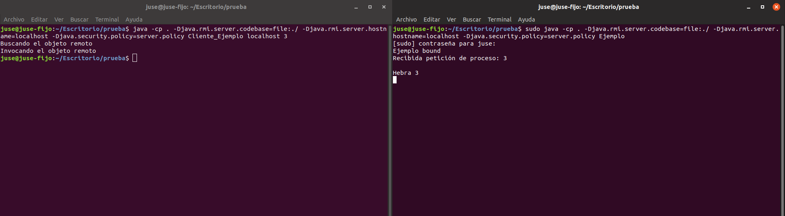
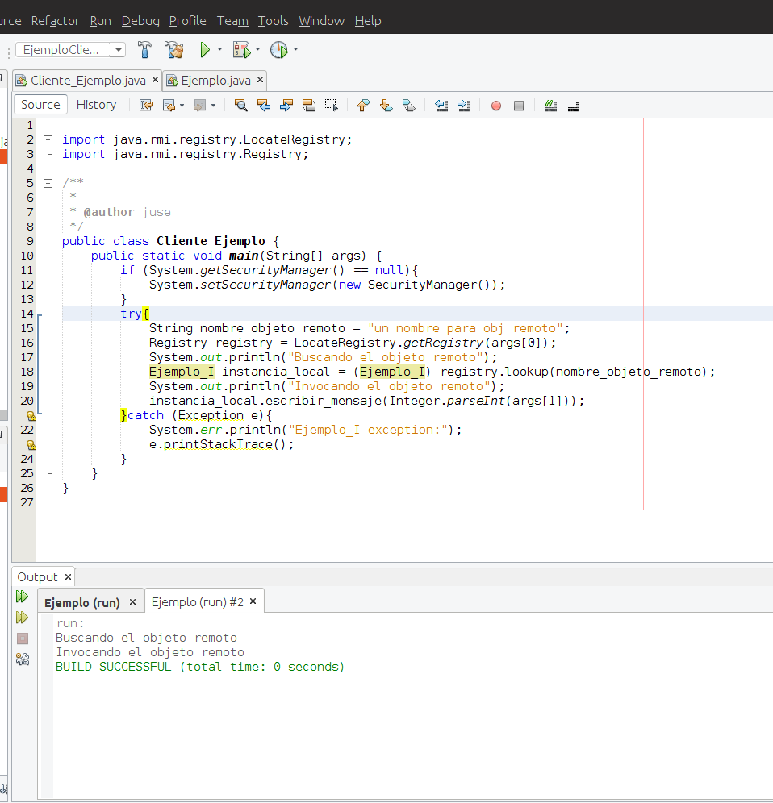
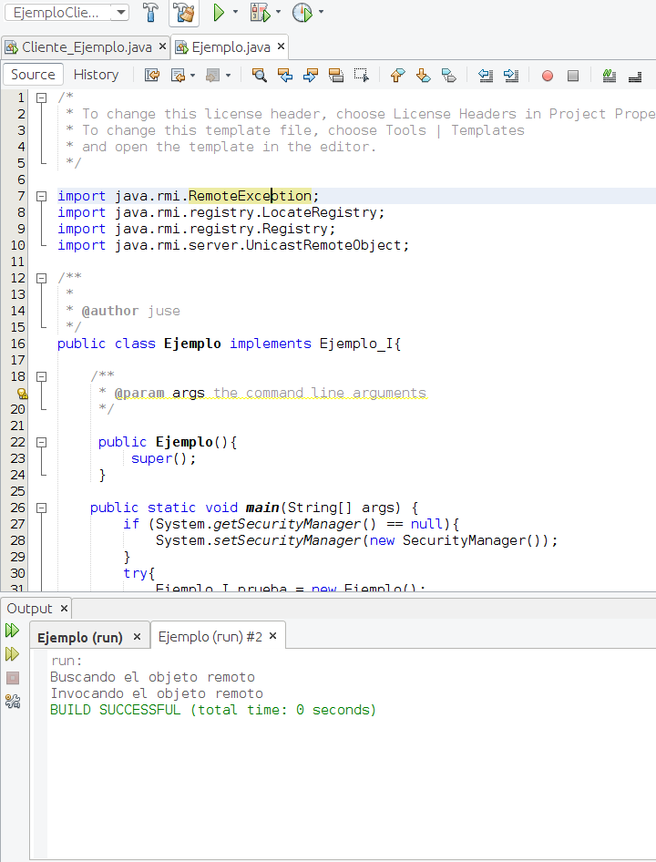
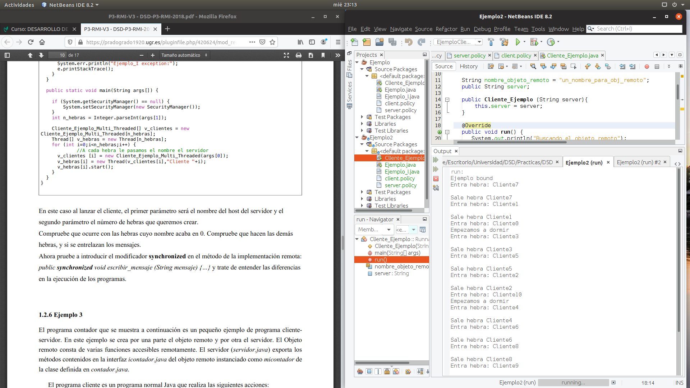
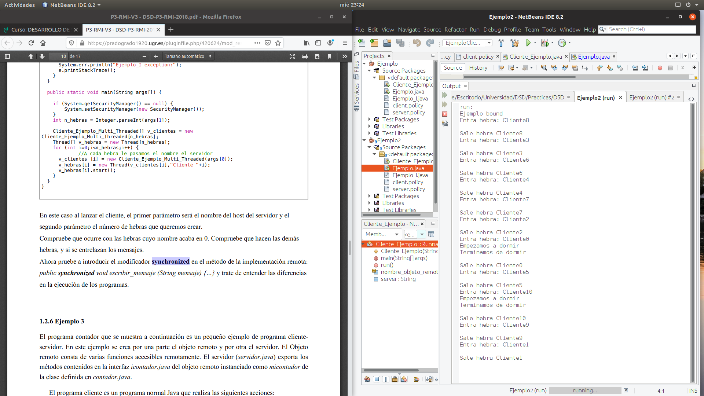
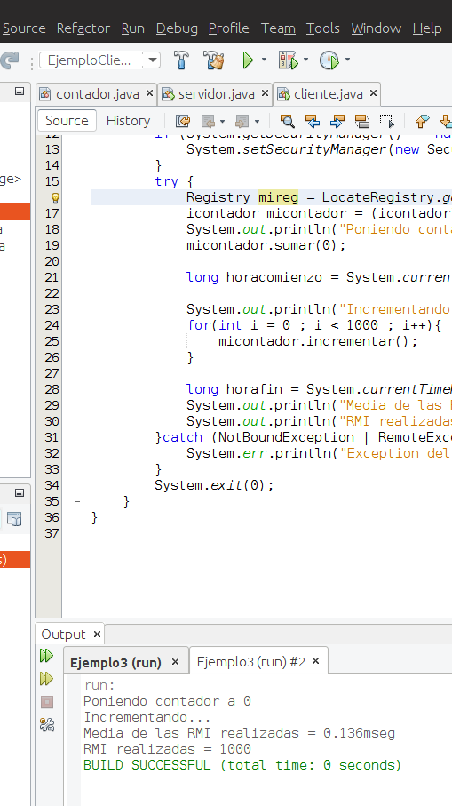
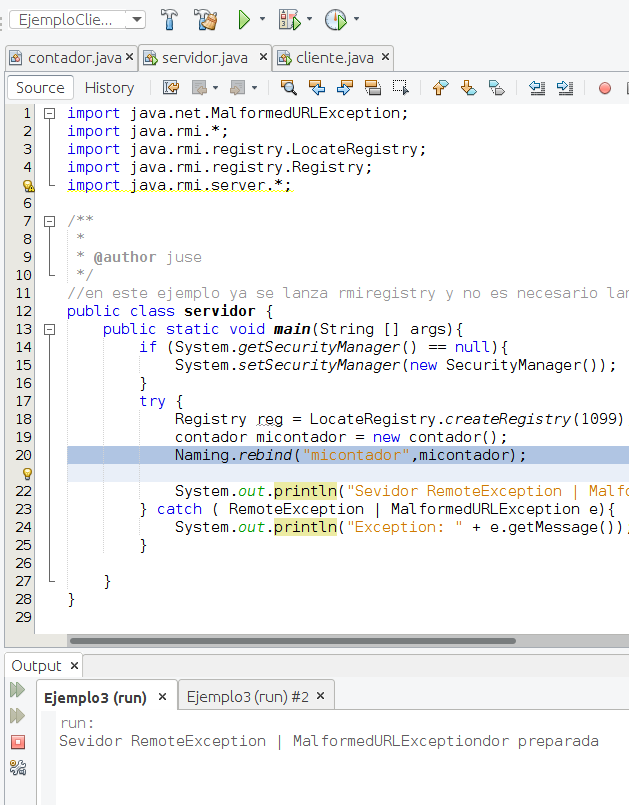

# Práctica 3: RMI    ~     José Santos Salvador

## Parte 1
En esta práctica usamos la tecnología RMI que se basa en la implementación de una serie de formularios de petición de objetos. Estos objetos se pueden transportar entre cliente y servidor. Esto permite utilizar objetos de cualquier tipo, ofreciendo más versatilidad que las tecnologías usadas en la práctica 1 y la 2.

#### Ejemplo 1

El primer ejemplo consiste en un programa cliente-servidor básico. El servidor exporta los métodos de la interfaz y cuando un cliente le envía una petición, imprime el argumento enviado. El cliente por su aprte, activa el gestor de seguridad, busca el objeto remoto e invoca el método escribir_mensaje con el argumento pasado.     
Primero realicé este primer ejemplo usando el terminal como te indica el guión.

Después de compilarlo y realizarlo por terminal, decidí hacerlo con netbeans. Para ello copie los archivos Cliente_Ejemplo.java, Ejemplo.java, Ejemplo_I.java y client.policy en Netbeans. Cree una configuración para el servidor 

    -Djava.security.manager -Djava.security.policy=./src/server.policy

y otra para el cliente

    -Djava.security.manager -Djava.security.policy=./src/client.policy

en VM option y para el cliente los argumentos que se le pasaba antes en la casilla Arguments

    localhost 3

Uno de los problemas que tuve realizandolo en netbeans fué el archivo policy, que tuve que modificar pero al confundirme con el guión de la práctica, no lo modifica de forma correcta. Y también tuve algún contratiempo buscando donde lanzar rmiregistry (que se solventa en el ejemplo3, donde no es necesario lanzar en build/classes).

#### Ejemplo 2
En este ejemplo se lanzan varios clientes mediante heras, se puede observar que RMI es multihebrado, habilitando la gestión concurrente de peticiones de los clientes.

    public class Cliente_Ejemplo implements Runnable{
    
    String nombre_objeto_remoto = "un_nombre_para_obj_remoto";
    public String server;
    
    public Cliente_Ejemplo (String server){
        this.server = server;
    }
    
    @Override
    public void run() {
       System.out.println("Buscando el objeto remoto");
       try{
           Registry registry = LocateRegistry.getRegistry(server);
           Ejemplo_I instancia_local = (Ejemplo_I) registry.lookup(nombre_objeto_remoto);
           System.out.println("Invocando el objeto remoto");
           instancia_local.escribir_mensaje(Thread.currentThread().getName());
       } catch (Exception e){
            System.err.println("Ejemplo_I exception:");
            e.printStackTrace();
        }
    }

Este ejemplo lo realicé desde el inicio en netbeans usando las configuraciones para compilar tanto el servidor, como el cliente.

Como se puede observar cuando entra alguna hebra(Cliente) que termina con 0, se duerme y esto provoca que otras hebran entren sin esperar a que la hebra acaba en cero salga, entrelazandose los mensajes y las entradas.

    public void escribir_mensaje(String mensaje) throws RemoteException {
        System.out.println("Entra hebra: "+mensaje);
        if (mensaje.endsWith("0")){
            try{
                System.out.println("Empezamos a dormir");
                Thread.sleep(5000);
                System.out.println("Terminamos de dormir");
            }

Para solucionarlo, hace falta declarar el método como synchronized, provocando así que cuando una hebra entre, el resto tengan que esperar a que esa hebra salga, eliminiando el entrelazamiento de los mensajes.[más información synchronized](https://docs.oracle.com/javase/tutorial/essential/concurrency/syncmeth.html
)

#### Ejemplo 3
En este ejemplo se crea un objeto remoto (contador.java que implementa icontador.java) en el servidor.java. 

    public class servidor {
    public static void main(String [] args){
        if (System.getSecurityManager() == null){
            System.setSecurityManager(new SecurityManager());
        }
        try {
            Registry reg = LocateRegistry.createRegistry(1099);
            contador micontador = new contador();
            Naming.rebind("micontador",micontador);

                            ... 

        }
    }

    //objeto contador
    public class contador extends UnicastRemoteObject implements icontador{
    private int suma;
    
    @Override
    public int sumar() throws RemoteException {
        return suma;
    }
                    ...
    }

El cliente por su parte pone un valor inicial al contador del servidor e invoca al método incrementar del contador 1000 veces y por último muestra el valor de contador y el tiempo de respuesta que le ha llevado calculadorlo.

    public class cliente {
    public static void main(String[] args){
        if (System.getSecurityManager() == null){
            System.setSecurityManager(new SecurityManager());
        }
        try {
            Registry mireg = LocateRegistry.getRegistry("127.0.0.1",1099);
            icontador micontador = (icontador)mireg.lookup("micontador");
            System.out.println("Poniendo contador a 0");
            micontador.sumar(0);
            
            long horacomienzo = System.currentTimeMillis();
            
            System.out.println("Incrementando...");
            for(int i = 0 ; i < 1000 ; i++){
                micontador.incrementar();
            }
            
            long horafin = System.currentTimeMillis();
            System.out.println("Media de las RMI realizadas = " + ((horafin -horacomienzo)/1000f) + "mseg" );
            System.out.println("RMI realizadas = " + micontador.sumar());
        }catch (NotBoundException | RemoteException e){
            System.err.println("Exception del sistema: " + e);
        }

En este ejemplo no es necesario llamar a rmiregistry con el terminal, ya que se encarga el servidor de hacerlo (imágenes abajo). Tuve que crear también una compilación para el servidor y el cliente y en este caso, el cliente no tiene ningún parametro.

