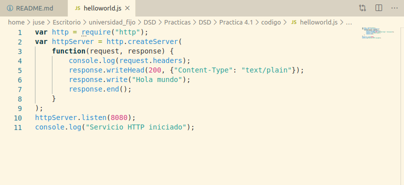

# Practica 4.1
En esta práctica vamos a realizar un desarrollo de servicios web con Node.js, SocketIo y MongoDB
## Servicios con Node.js
Node.js es una entorno para la capa del servidor basado en JavaScript. Permitiendo implementar servicios web, estos servicios son asíncronos y dirigidos por eventos, maximizando la escalabilidad y la eficiencia de dichos servicios.
Para realizar un hola mundo, primero se obtiene el modulo http para usar protocolo http. 

Debemos pasar como parametros a cualquier función un callback

En el ejemplo de la Calculadora, tuve algunos fallos porque escribia en el navegador 

    http://localhost:8080/+/2/3
    
ya que pensaba que era así y luego me di cuenta de que la forma correcta es 

    http://localhost:8080/sumar/2/3

