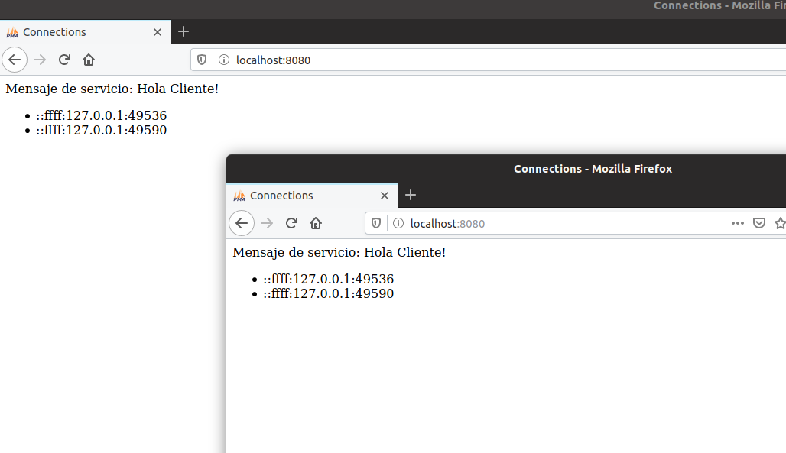

# Practica 4.1
En esta práctica vamos a realizar un desarrollo de servicios web con Node.js, SocketIo y MongoDB
## Servicios con Node.js

### 1.Hola mundo
Node.js es una entorno para la capa del servidor basado en JavaScript. Permitiendo implementar servicios web, estos servicios son asíncronos y dirigidos por eventos, maximizando la escalabilidad y la eficiencia de dichos servicios.
Para realizar un hola mundo, primero se obtiene el modulo http para usar protocolo http. 

    var http = require("http");
    var httpServer = http.createServer(
	function(request, response) {
		console.log(request.headers);
		response.writeHead(200, {"Content-Type": "text/plain"});
		response.write("Hola mundo");
		response.end();
	}
    );
    httpServer.listen(8080);
    console.log("Servicio HTTP iniciado");

Debemos pasar como parametros a cualquier función un callback

### 2.Calculadora

Para la realización de la calculadora, se crea una función para calcular las operaciones (antes de lanzar el servidor)

    function calcular(operacion, val1, val2) {
	if (operacion=="sumar") return val1+val2;
	else if (operacion == "restar") return val1-val2;
	else if (operacion == "producto") return val1*val2;
	else if (operacion == "dividir") return val1/val2;
	else return "Error: Par&aacute;metros no v&aacute;lidos";
    }

Y es al lanzar el servidor, donde se leen los parametros para realizar las operaciones

    function(request, response) {
		var uri = url.parse(request.url).pathname;
		var output = "";
		while (uri.indexOf('/') == 0) uri = uri.slice(1);
		var params = uri.split("/");
		if (params.length >= 3) {
			var val1 = parseFloat(params[1]);
			var val2 = parseFloat(params[2]);
			var result = calcular(params[0], val1, val2);
			output = result.toString();
		}

En el ejemplo de la Calculadora, tuve algunos fallos porque escribia en el navegador 

    http://localhost:8080/+/2/3
    
ya que pensaba que era así y luego me di cuenta de que la forma correcta es 

    http://localhost:8080/sumar/2/3

.

Tambien se puede usar **"Cliente"** para enviar esa petición al servidor y recibir la respuesta. Para ello se usa calc.html, donde se envia la petición, con la función envia al pulsar el boton

    function enviar() {
			var val1 = document.getElementById("val1").value;
			var val2 = document.getElementById("val2").value;
			var oper = document.getElementById("operacion").value;
			
			var url = serviceURL+"/"+oper+"/"+val1+"/"+val2;
			var httpRequest = new XMLHttpRequest();
			httpRequest.onreadystatechange = function() {
		    	if (httpRequest.readyState === 4){
		        	var resultado = document.getElementById("resul");
		        	resultado.innerHTML = httpRequest.responseText;
		        }
		    };
			httpRequest.open("GET", url, true);
			httpRequest.send(null);
		}

.

Tuve problemas al realizar el ejercicio y es que me salía este error al usar el html de cliente

    CORS header 'Access-Control-Allow-Origin' missing

Y tras buscar por internet acabé encontrando con que era necesario añadirle una cosilla al response.writeHead del archivo de nodejs para permitir que le enviase la petición el cliente.

    		response.writeHead(200, {"Content-Type": "text/html","Access-Control-Allow-Origin": "*"});		response.write(output);

### 3.Servidor web con Cliente
Con calculadora web, cargamos el archivo html 

    var httpServer = http.createServer(
	function(request, response) {
		var uri = url.parse(request.url).pathname;
		if (uri=="/") uri = "/calc.html";
		var fname = path.join(process.cwd(), uri);
		fs.exists(fname, function(exists) {
			if (exists) {
				fs.readFile(fname, function(err, data){
					if (!err) {
						var extension = path.extname(fname).split(".")[1];
						var mimeType = mimeTypes[extension];
						response.writeHead(200, mimeType);
						response.write(data);
						response.end();
					}

y se realiza el calculo de las operaciones tras recibir la petición del archivo html por parte del cliente

    			else{
				while (uri.indexOf('/') == 0) uri = uri.slice(1);
				var params = uri.split("/");
				if (params.length >= 3) { //REST Request
					console.log("Peticion REST: "+uri);
					var val1 = parseFloat(params[1]);
					var val2 = parseFloat(params[2]);
					var result = calcular(params[0], val1, val2);
					response.writeHead(200, {"Content-Type": "text/html"});
					response.write(result.toString());
					response.end();
				}
				else {
					console.log("Peticion invalida: "+uri);
					response.writeHead(200, {"Content-Type": "text/plain"});
					response.write('404 Not Found\n');
					response.end();
				}
			}

Todo ello de forma asincrona con javascript.

### 4.Socket.io
Hasta este punto, es el cliente el que envia peticiones al servidor pero tambien es posible mandar mensajes del servidor al cliente, para ello hacemos uso de un web socket. Esta tecnología está basada en evento y con callBack.  
Mediante el uso de socket.io se puede enviar información a cada cliente y al abrir distintas ventanas, se van actualizando la información de los clientes, enviando dichos los datos de  allClientes (dirección y puerto de cada cliente), tras producirse el evento io.sockets.on('connection')

    io.sockets.on('connection',
        function(client) {
            allClients.push({address:client.request.connection.remoteAddress, port:client.request.connection.remotePort});
            console.log('New connection from ' + client.request.connection.remoteAddress + ':' + client.request.connection.remotePort);
            io.sockets.emit('all-connections', allClients);

Dicha actualización de información se realiza mediante el html (Cliente), el servidor llama los clientes 

    	io.sockets.emit('all-connections', allClients);
		client.on('output-evt', function (data) {
			client.emit('output-evt', 'Hola Cliente!');
		});

y por ejemplo al llamar a all-conections por parte del servidor, el cliente (conections.html) realiza lo siguiente

    socket.on('all-connections', function(data) {
			actualizarLista(data);
		});
		socket.on('disconnect', function() {
			mostrar_mensaje('El servicio ha dejado de funcionar!!');
		});

Y actualizar lista, actualiza el html.

		function actualizarLista(usuarios){
			var listContainer = document.getElementById('lista_usuarios');
			listContainer.innerHTML = '';
			var listElement = document.createElement('ul');
			listContainer.appendChild(listElement);
			var num = usuarios.length;
			for(var i=0; i<num; i++) {
	            var listItem = document.createElement('li');
	            listItem.innerHTML = usuarios[i].address+":"+usuarios[i].port;
	            listElement.appendChild(listItem);
	        }
	    }

   

tras añadir mas cliente

y de la misma forma cuando un cliente se desconecta se busca en el array y el que coincide se elimina de la lista y se vuelve a llamar al resto de clientes para actualizar su información.

    client.on('disconnect', function() {
			console.log("El cliente "+client.request.connection.remoteAddress+" se va a desconectar");
			console.log(allClients);

			var index = -1;
			for(var i = 0; i<allClients.length;i++){
				//console.log("Hay "+allClients[i].port);
				if(allClients[i].address == client.request.connection.remoteAddress
					&& allClients[i].port == client.request.connection.remotePort){
					index = i;
				}			
			}

			if (index != -1) {
				allClients.splice(index, 1);
				io.sockets.emit('all-connections', allClients);
			}else{
				console.log("EL USUARIO NO SE HA ENCONTRADO!")
			}
			console.log('El usuario '+client.request.connection.remoteAddress+' se ha desconectado');
		});

### 5.Socket.io

Tras instalar mongodb, se llama con mongo
.
En esta parte vamos a guardar al cliente que acceda al servidor, en la base de datos de MongoDB. 
Cuando alguien se conecta, se envia al cliente la dirección del host y cuando el cliente me envia el envento poner, guardo en la base de datos . Y cuando se llama a la función obtener, se envia al cliente.

    MongoClient.connect("mongodb://localhost:27017/", function(err, db) {
	httpServer.listen(8080);
	var io = socketio.listen(httpServer);

	var dbo = db.db("pruebaBaseDatos");
	dbo.createCollection("test", function(err, collection){
    	io.sockets.on('connection',
		function(client) {
			client.emit('my-address', {host:client.request.connection.remoteAddress, port:client.request.connection.remotePort});
			client.on('poner', function (data) {
				collection.insert(data, {safe:true}, function(err, result) {});
			});
			client.on('obtener', function (data) {
				collection.find(data).toArray(function(err, results){
					client.emit('obtener', results);
				});
			});
		});
    });
    });

Y en el cliente cuando obtienes poner, envia los datos y cuando es obtener actualizas lista

    		socket.on('my-address', function(data) {
			var d = new Date();
			socket.emit('poner', {host:data.host, port:data.port, time:d});
			socket.emit('obtener', {host: data.address});
		});
		socket.on('obtener', function(data) {
			actualizarLista(data);
		});
Toda esta información de la bd se muestra en formato JSON, permitiendo iterarlo de forma más sencilla

