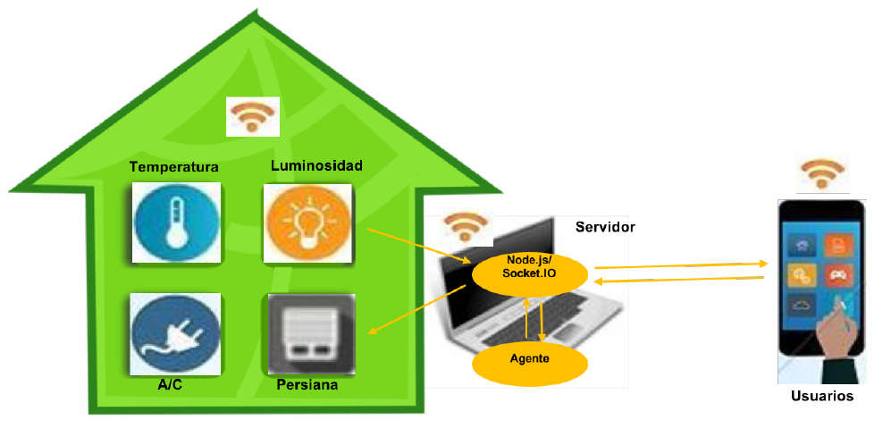
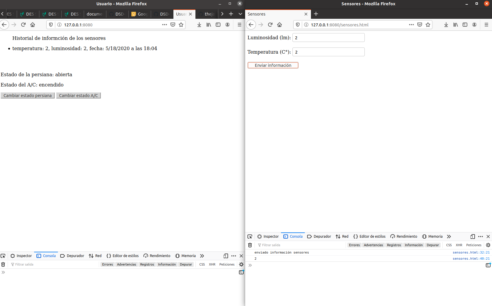
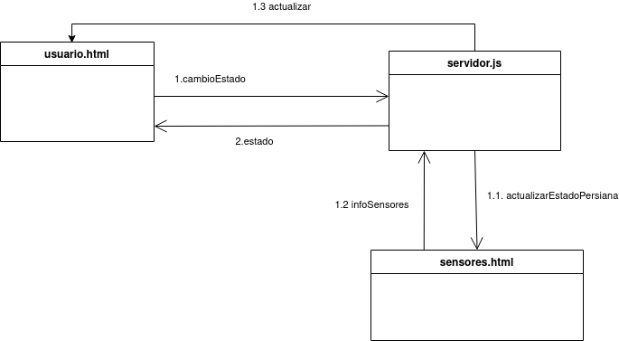
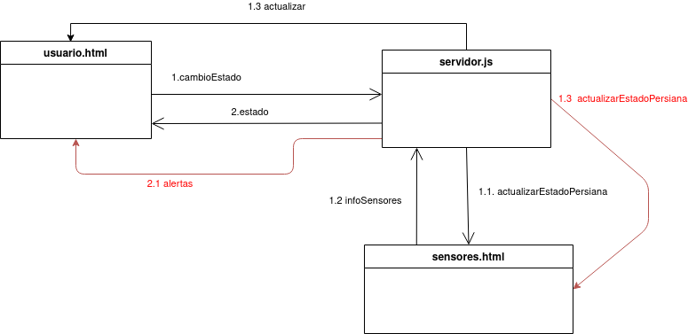
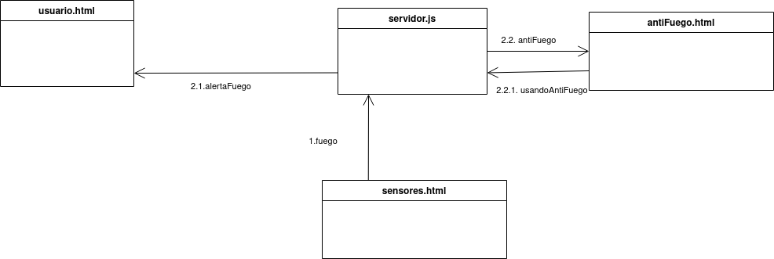
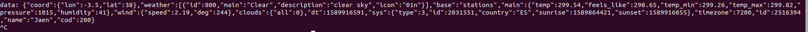

# Practica 4.2: Sistema domótico ~ José Santos Salvador
En esta práctica vamos a realizar el desarrollo de un sistema domótico básico compuesto de dos sensores (luminosidad y temperatura), dos actuadores (motor persiana y sistema de aire acondicionado), un servidor que sirve páginas para mostrar el estado y actuar sobre los elementos de la vivienda. Dicho servidor tiene también un agente capaz de notificar alarmas y tomar decisiones. Importante leer la referencía antes de continuar con el trabajo [5].

## Usuario y servidor básicos
En primer lugar decidí crear el servidor (archivo node js) y el usuario (archivo html) de una forma básica e inspirandome en los ejemplos de la parte obligatoria. Con el servidor tuve dudas respecto a los sensores. No tenía muy claro si los sensores eran datos aleatorios mediante una hebra o era necesario crear un archivo html para estos. Tras comprender mejor el pdf, me dí cuenta de que era necesario crear un archivo html y este sería mediante un formulario el que enviaría los datos al servidor. Pensé que la mejor idea era que el servidor despachara esas url de la siguiente forma (utilizando una filosofía de url limpia y dejando el servidor como manejador de url, tal y como hago en SIBW con php pero aqui con node)

    let http = require('http');
    let fs = require('fs');
    
    let handleRequest = (request, response) => {
        console.log(request.url);
        if(request.url == '/sensores.html')
        {    
            response.writeHead(200, {
                'Content-Type': 'text/html'
            });
            fs.readFile('sensores.html', null, function (error, data) {
                if (error) {
                    response.writeHead(404);
                    response.write('Whoops! js not found!');
                } else {
                    response.write(data);
                }
                response.end();
            });
        }
        else
        {    
            response.writeHead(200, {
                'Content-Type': 'text/html'
            });
            fs.readFile('./usuario.html', null, function (error, data) {
                if (error) {
                    response.writeHead(404);
                    response.write('Whoops! File not found!');
                } else {
                    response.write(data);
                }
                response.end();
            });
        }
    };
    
    http.createServer(handleRequest).listen(8181);

Pero me di cuenta de que esto violaría en cierta medida la separación de responsabilidades y la ocultación de funcionamiento, ya que el usuario accede al servicio mediante la url pero los sensores no pueden ser accedidos por el usuario. Por lo tanto decidí cargar unicamente usuario.html en el servidor y para acceder a los sensores, abrir el html de forma "manual". 

    var httpServer = http.createServer(
	function(request, response) {
        var uri = request.url;
		var fname = path.join(process.cwd(), uri);
		fs.exists(fname, function(exists) {
			if (exists && (uri == 'usuario.html' || uri == 'sensores.html')) {
				fs.readFile(fname, function(err, data){
					if (!err) {
						var extension = path.extname(fname).split(".")[1];
						var mimeType = mimeTypes[extension];
						response.writeHead(200, mimeType);
						response.write(data);
						response.end();
					}

                            ...

Usuario tiene un historial de la información del sensor (de la sesión), las temperaturas y luminosidad actuales, así como los estados del AC y persiana y sus botones para cambiar de estado y las zonas donde irán las alertas.

    <body>
        

            <ul id="list">
                
Historial de información de los sensores (sesión actual) 

            </ul>
        

          
		

            

                Estado de la persiana: 
            

            
            
 
                Estado del A/C: 
            

			<button id="cambiarEstadoPersiana" style="background-color: LightGray;" onclick="cambiarEstadoPersiana()">Cambiar estado persiana </button>
			<button id="cambiarEstadoAC" style="background-color: LightGray;" onclick="cambiarEstadoAC()">Cambiar estado A/C</button>
        

         
        

            

                Luminosidad (lm): 
            

            
 
                Temperatura (C°): 
            

        

    </body>

## Sensores
Para crear sensores.html entendí que era necesario una simulación de estos datos, sin embargo y tras hablar por el foro y leer el guión me di cuenta de que era mediante un formulario den sensores.html donde se enviaría esos datos al servidor (con formato JSON) y este se lo enviaría a todos los usuario.[2]

        
        

socket.emit('infoSensores) envía la información al servidor y este se la envía al usuario y la guarda en la base de datos.

        io.sockets.on('connection',
		function(client) {

			client.on('infoSensores', function (data) {

                collection.insert(data, {safe:true}, function(err, result) {});

                var informacion = "temperatura: " + data.temperatura + ", luminosidad: " + data.luminosidad + ", fecha: " + data.fecha;

                io.sockets.emit('actualizar',informacion);
                
            });

                            ...

Para realizar esta parte me encontré con dificultades, fruto de no tener mucha práctica con estas tecnologías. Para acceder a sensores.html, lo hacía desde el sistema de fichero y esto me reportaba el siguiente error:

        <script> con origen "file:///socket.io/socket.io.js". sensores.html
        ReferenceError: io is not defined.
        
esto se producía ya que al no acceder desde el servidor, no encontraba el archivo socket.io.js y por tanto no definía la variable io. Para ello hace falta acceder de la siguiente forma

    http://127.0.0.1:8080/sensores.html

Cabe destacar que para depurar use la orden 

    document.write('
Print this after the script tag
')

y a la hora de hacer el formulario tuve que buscar como llamar a una función en javascript ya que yo solo sabía hacerlo con PHP (en sensores.html) [1]

    		<form action="javascript:void(0);" onsubmit="javascript:enviarInformacion();">
            <label for="fname">Luminosidad (lm):</label>
                        ...
          </form> 

sensores funcionando

## Cambiar y obtener estados persiana y AC
Después de realizar el sensor, me puse con los estados de persiana y AC,para ello es necesario pedir el estado de la persiana y AC para poder mostrarlo (ojo con el orden para declarar las funciones, esto es Javascript ;) ) .

        socket.on('estadoPersiana', function(data){
            var estadoPersiana = document.getElementById('estadoPersiana');
            estadoPersiana.innerHTML = data;
        });

        socket.on('estadoAC', function(data){
            var estadoAC = document.getElementById('estadoAC');
            estadoAC.innerHTML = data;
        });

        socket.emit('getEstadoPersiana');
        socket.emit('getEstadoAC');

El servidor recibe dicha petición y le muestra el valor del estado de la solicitud (dos variables que tiene almacenadas, estadoPersiana y estadoAC, encendido y abierto por defecto)

    			client.on('getEstadoPersiana', function (data){
				client.emit('estadoPersiana', estadoPersiana);
			});

			client.on('getEstadoAC', function (data){
				client.emit('estadoAC', estadoAC);
			});

Tras realizar esto me dispuse a desarrollar los cambios de estado de persiana y AC. Para es necesario que tras clickar en el botón el usuario en usuario.html,

    			<button id="cambiarEstadoPersiana" style="background-color: LightGray;" onclick="cambiarEstadoPersiana()">Cambiar estado persiana </button>

 se le envíe una petición al servidor cambiando el estado de la persiana
 
                        function cambiarEstadoPersiana(){
            socket.emit('cambiarEstadoPersiana');
            }

reciba la respuesta por parte del servidor para cambiar el estado (añadir en el html). 

            socket.on('estadoPersiana', function(data){
            var estadoPersiana = document.getElementById('estadoPersiana');
            estadoPersiana.innerHTML = data;
            });

Aunque en el guión no aparece añadí de forma adicional que tras cambiar el estado de la persiana o del AC, el servidor enviará una petición al sensor (simulando que tras cambiar el estado, vuelve a tomar las medidas), este da respuesta al servidor y el servidor a su vez llama al resto de cliente para que actualicen su información.

        	client.on('cambiarEstadoPersiana', function (data){
				if (estadoPersiana == 'abierta')
					estadoPersiana = 'cerrada';
				else
					estadoPersiana = 'abierta';

				io.sockets.emit('estadoPersiana', estadoPersiana);
				//llamas a todos los usuarios

				io.sockets.emit('actualizarEstadoPersiana', {persiana:estadoPersiana, temperatura:temperatura, luminosidad:luminosidad});
			});	

Los sensores tienen dos variables donde se almacenan la temperatura y la luminosidad, además de un valor factor que intenta simular la estación del año. Esto quiere decir que si fuese invierno factor tendría un valor negativo, ya que si tu abres la ventana en invierno, la temperatura baja y en el casod de la luminosidad, se hace un valor absoluto, independientemente si es verano o invierno, si abres la ventana, aumenta la luminosidad. En mi caso, el factor está en verano y si apagas el AC, entonces aumenta la temperatura y si abres la persiana también aumenta la temperatura ya que entra el calor de fuera.

servidor

    			client.on('cambiarEstadoPersiana', function (data){
				if (estadoPersiana == 'abierta')
					estadoPersiana = 'cerrada';
				else
					estadoPersiana = 'abierta';

				io.sockets.emit('estadoPersiana', estadoPersiana);
				//llamas a todos los usuarios

				io.sockets.emit('actualizarEstadoPersiana', {persiana:estadoPersiana});

				//aqui añadir un mensaje a sensores para cambiar información
				//tanto de luz como de temperatura
			});	

sensores.html

            socket.on('actualizarEstadoPersiana', function(data){

            if(data.persiana == 'abierta')
            {
                temperatura = temperatura + factor;
                luminosidad = luminosidad + Maths.abs(factor);
            }
            else{
                temperatura = temperatura - factor;
                luminosidad = luminosidad - Maths.abs(factor);
            }
            var date =  new Date();
            var fecha = (date.getMonth()+1) + "/" + date.getDate()+ "/" + date.getFullYear() + " a las "+ date.getHours() + ":" + (date.getMinutes()<10?'0':'') + date.getMinutes();

            socket.emit('infoSensores', {temperatura:temperatura, luminosidad:luminosidad, fecha:fecha});
        });

Hasta este punto, tuve que solucionar un fallo en el que llamaba desde servidor.js de la siguiente forma a sensores.html 
    				client.emit('cambioEstadoAC', estadoAC);

como es lógico, fallaba y al darme cuenta lo cambie por

        				io.sockets.emit('actualizarEstadoPersiana', {persiana:estadoPersiana});

Para aclarar lo que se realiza aquí, he diseñado un diagrama báscio para ilustrarlo. [3]

Primero el usuario pide un cambioEstado tras clickar en el botón, el servidor lo recibe y le envía el cambio de estado para poder mostrar en el html del usuario y además el servidor le dice a sensores que se ha cambiado el estado, entonces este actualiza su información respecto a la temperatura y la luminosidad. Tras actualizar su información, le dice al servidor que ha actualizado su información (infoSensores) y el servidor le envía la información actualizada al usuario. (video probando esto) [4]   
Añadir también que estos cambios de estados se realizan para todos los usuarios.

## Agente
Con el afán de mantener una correcta separación de responsabilidades, servidor tiene los estados de AC y de la persiana y el sensor.html tiene la temperatura y la luminosidad. 

			function agente(temperatura,luminosidad){
				console.log("agente trabajando");

				if(!cambioEstado)
				{

                    if(temperatura <= temperaturaMinima)
                        io.sockets.emit('alertas', "Peligro!!, temperatura por debajo de la mínima");

                                                ...

                    if(temperatura >= temperaturaMaxima || luminosidad >= luminosidadMaxima){
                        console.log("cerrando persiana");
                        if(estadoPersiana != 'cerrada')
                        {
                            io.sockets.emit('estadoPersiana', 'cerrada');
                            io.sockets.emit('actualizarEstadoPersiana', {persiana:'cerrada'});
                        }
                    }

                                    ... 

Por lo tanto a la hora de actuar el agente, he implementado una función agente que se le pasa una temperatura y una luminosidad y esta función la que se encarga de decidir si actuar sobre los estados de AC y de la persiana, así como de alertar al usuario. Dicha función agente se llama, cada vez que el sensor le envía información actualizada al servidor.

    			client.on('infoSensores', function (data) {

                collection.insert(data, {safe:true}, function(err, result) {});

                var informacion = "temperatura: " + data.temperatura + ", luminosidad: " + data.luminosidad + ", fecha: " + data.fecha;

                                ...
				agente(data.temperatura,data.luminosidad);
			});

Es de interés señalar que mi agente si enciendes el AC y este provoca que aumente la temperatura (o la luminosidad) por encima de la temperatura máxima, entonces este recibe la temperatura cambiada por el sensor gracias al servidor y cierra la persiana (tal y como dice el guión). También hago algunas **consideraciones adicionales** en el agente y controlo si tanto la temperatura como la luminosidad se encuentran entre unos intervalos (tanto máximos como mínimos) peligrosos y realiza acciones como cerrar persianas o apagar el AC. Esto hace posible que no haga falta llamar al agente desde el cambio de estado, ya que en el cambio de estado se llama a sensores y este llama a servidor (mirar sección del cambio de estado, hablado en el punto anterior) con la nueva información (y aqui llama a agente).

    			if(temperatura < intervaloTempeSupMaximo && temperatura > intervaloTempeInfMaximo)
				{
					if(estadoAC != 'encendido')
					{
						io.sockets.emit('estadoAC', 'encendido');
						io.sockets.emit('actualizarEstadoAC', {AC:'encendido'});
						io.sockets.emit('alertas', "Se ha encendido AC por agente");
					}

				}

alertas recibidas por el usuario

    	socket.on('alertas', function(data) {
            console.log("alertado por agente");

            var alerta = document.getElementById('peligro');
            alerta.innerHTML = data;
        });

Aviso a los usuarios de que ha sido el agente quien lo ha realizado, todo ello para no asustarlos (podrían pensar que todo está controlado por Hal 9000 y no queremos eso).
Además, el agente también observa si se ha producido un cambio de estado y si la ventana está abierta y el AC encendido, avisa mediante una alerta al usuario.

            function agente(temperatura,luminosidad, cambioEstado){
				console.log("agente trabajando");

				if(!cambioEstado)
				{
                    ...

                else{
					if(estadoAC == 'encendido' && estadoPersiana == 'abierta')
						io.sockets.emit('alertas', "Tienes la ventana abierta y el AC encendido");
				}

Tal y como se ve en el diagrama, cuando se realiza un cambio de estado y sensores.html devuelve la información actualiza (1.2infoSensores), servidor.js llama a la función agente y esta tras recibir una anomalía, realiza un cambio de estado y vuelve a llamar a actualizarEstado (con el cambio correspondiente) de sensores.html y este ya si devuelve la información actualizada que se envía al usuario.html.
.
He realiza un video mostrando su funcionamiento como en el punto anterior, ya que con imagenes no creo que se ilustre de forma correcta (videos/agente.webm)

## Detector de humo
Para esta sección, cree un detector de humo. Si este recibía una alerta de fuego por parte de los sensores, activa el sistema de aspersores internos y lo apaga.  
Respecto a sensores html, unicamente añado un boton que envía un mensaje al servidor avisandole de fuego, la temperatura sube (variable temperaturaFuego) y también se informa de dicho cambio al servidor.

        <button id="detectarFuego" style="background-color: red;" onclick="enviarFuego()">Detectar fuego</button>

                        ...

        function enviarFuego(){
            temperatura = temperaturaFuego;
            socket.emit('infoSensores', {temperatura:temperatura, luminosidad:luminosidad, fecha:fecha});
            socket.emit('fuego');
        }

Cuando el servidor recibe la señal de fuego, llama al sistema antiFuego y le envía una alerta al usuario  (en otra zona distinta a la de alertas, alertaFuego)

            client.on('fuego', function (data){
                io.sockets.emit('antiFuego');
                io.sockets.emit('alertaFuego', "Se detectado fuego y se ha usado el sistema de agua");
			});

Y es el sistema antiFuego el que utiliza el sistema de agua, guarda en su registro propio de fuegos y emite un sonido de alarma (para apagar hace falta cliclar al botón para desactivarla) inspirado por un compañero en el foro.

    socket.on('antiFuego', function(data) {
        console.log("utilizando aspersores");
        socket.emit('usandoAntiFuego',temperatura);

        var listElement = document.getElementById('list');
        var listItem = document.createElement('li');

        date =  new Date();
        fecha = (date.getMonth()+1) + "/" + date.getDate()+ "/" + date.getFullYear() + " a las "+ date.getHours() + ":" + (date.getMinutes()<10?'0':'') + date.getMinutes();

        var data = {fuego:"hubo un fuego ",fecha:fecha};

        listItem.innerHTML = "Fuego con fecha: " + fecha;
        listElement.appendChild(listItem);

        fuego.muted = false;
		fuego.play();
    });
                        ...

    function apagarAlarma(){
        console.log("apgando alarma");
        fuego.muted = true;
    }

y el servidor cuando recibe la respuesta de antiFuego.html, abre las ventanas y le alerta al usuario.

    		client.on('usandoAntiFuego',function(data){
				if(estadoPersiana != 'abierta')
				{
					io.sockets.emit('estadoPersiana', 'abierta');
					io.sockets.emit('actualizarEstadoPersiana', {persiana:'abierta'});
					io.sockets.emit('alertas', "Se ha abierta la persiana por el fuego");
				}

				io.sockets.emit('tempeFuego',data);
			});

Tuve algunos problemas a la hora de llamar desde antiFuego.html al servidor, ya que no lo estaba llamando con socket.on y también me confundí usando el formato JSON, ya que metía en el html directamente el objeto (Object) y no el valor de este.   

Puede ser algo lioso pero lo he realizado así para mantener las responsabilidades. Para aclarar el funcionamiento, he creado un diagrama algo simplificado para que se vean las partes importantes (al tener varios sistemas, habría mas relaciones y distintas peticiones pero así es mas sencillo de ver)

Así mismo, tengo que decir que no he añadido un botón añadir sensor (sugerencia del pdf), ya que como se ha visto en esta sección, añadir un nuevo sensor es algo complejo y para realizar ese añadir sensor, habría que realizar de una forma algo límitada o sencilla y he preferido añadir un nuevo sensor de forma manual con más funcionalidades y complejidad.

## Base de datos MongoDB funciones adicionales
En este punto, se puede ver que la página del usuario ha ido aumentando y con ella también se ha empeorado su interfaz. Sin embargo, esto es algo "intencionado" ya que considero que la finalidad de la práctica no está en la parte de css o de html, si no que está en el uso de nodejs y mongoDB.    
Por tanto, decidí realiazar mas funciones con mongoDB y aunque ya insertaba los datos en la BD, es cierto que el usuario solo veía dicha sesión html. Para ello he ampliado a un apartado de Información de BD en usuario.html.  
Para ello, usuario.html llama al servidor pidiendo esos datos y este le envía los tres últimos registros que tiene

            //servidor.js
    		client.on('registro', function () {

				collection.find().sort({_id:-1}).limit(3).forEach(function(result){
					var informacion = "temperatura: " + result.temperatura + ", luminosidad: " + result.luminosidad + ", fecha: " + result.fecha;
					client.emit('registroBD',informacion);
				});
			});

Pensé en realizar esto mismo con el registor de fuego, al principio comencé a realizarlo sobre la misma collections pero lo deseché por no mezclar información y documentos, **funcionaba de forma correcta y eso denota la versatilidad que proporcionan las base de datos NoSQL**. Realizé una nueva collections para los registros de fuegos y con dos funciones para insertas dichos fuegos en la collections y para mostrar los últimos 4 registros (es cierto que envía 4 mensajes, intenté realizar con un array pero no supe hacerlo bien al final, ya que el forEcha es una función y el ámbito de clase me daba errores con el array declarado anteriormente)

    	dbo.createCollection("registrosFuego", function(err, collection){
    	io.sockets.on('connection',
		function(client) {

		client.on('registroFuego', function(data){
			collection.insert(data, {safe:true}, function(err, result) {});
			console.log("guardando registro fuego");

		});

		client.on('registroBDFuego', function () {
			collection.find().sort({_id:-1}).limit(4).forEach(function(result){
				var informacion = "Hubo un fuego en la fecha:  " + result.fecha;
				console.log("recogiendo datos fuego");
				client.emit('actualizarInfoFuego',informacion);
			});
		});
	});
    });

El funcionamiento es igual que con usuario.html pero en antiFuego.html    
En mi estudio de mongoDB, quise realizar una consulta tradicional y tras buscar información, desarrollo una funcionalidad por la cual el usuario envía un valor de la temperatura y te muestra las temperaturas que hay en el registro mayores que esa (limitado a 10).

        //usuario.html
        function obtenerConsulta(datos){
            var tempe = document.getElementById("tempe").value;

            socket.emit('temperaturaValor',tempe);
            socket.on('consultaTemperatura',function(data){
                actualizarConsulta(data);
            });
        }

Y es el servidor el que realizar dicha consulta, $gt es el operador y significa mayor (greater, tambien vi algunos como $eq que es igual)

            //servidor.js
        	client.on('temperaturaValor',function(data){
				//lo limito a 10
				collection.find({ temperatura: { $gt: data } }).limit(10).sort({_id:-1}).forEach(function(result){
					var informacion = "temperatura: " + result.temperatura + ", luminosidad: " + result.luminosidad + ", fecha: " + result.fecha;
					client.emit('consultaTemperatura',informacion);
				});
			});		

Video funcionando con la BD y el detector de humo(video/fuego.webm)  

Considero que es de vital importancia, hablar de lo que ha supuesto realizar esta sección con mongoDB y es que yo no había trabajado con ninguna base de datos NoSQL y además me ha costado mucho entender como hacer las consultas y además cuando se han realizado estas, saber recibir ese resultado y tratarlo. MongoDB trabaja con documentos y estas collections ("MongoDB stores BSON documents, i.e. data records, in collections; the collections in databases"). Añado en estas referencías los enlaces que he usado para aprender mongoDB[6][7]

## Obtener valores por url
Por curiosidad quise mirar como hacer el GET de php pero con nodejs, utilizando el paquete url que ya habíamos usado en el ejemplo, realice este código

    		const url = require('url');
		var adr = "http://127.0.0.1:8080" + request.url;
		// new URL object
		const current_url = new URL(adr);
		
		// get access to URLSearchParams object
		const search_params = current_url.searchParams;
		
		// get url parameters
		nombre = search_params.get('atracador');

		console.log(nombre);

		if(nombre != null)
			robo();

se obtiene el valor de atracador pasado por la URL y se llama a la función robo.  
Quise hacer que agente actuara enviado una alerta pero está en ámbitos distintos (servidor con createServer y base de datos con connect) y no lo conseguí realizar.

## Uso de una API
Tras haber realizado indirectamente el uso de módulos con socket.io y npm , decidí que era mejor aprender a como usar una API con nodejs. Siguiendo un sencillo tutorial de internet [8], me puse a crear esa petición a una API llamada OpenWeatherMap (es gratuita).  
Primer tuve que registrar para que me diesen mi APIKey, tras esto realice el package.json (podría decirse que es el manifiesto de nuestro proyecto)

y finalmente la susodicha llamada a la API (haciendo uso del paquete resquest).

    var apiKey = '89b2e927d79029343f1fd3e0ce0f8071';
	var ciudad = 'Jaen';
	var url = `http://api.openweathermap.org/data/2.5/weather?q=${ciudad}&appid=${apiKey}`;

	request(url, function (err, response, data) {
	  if(err){
		console.log('error:', error);
	  } else {
		var tiempo = JSON.parse(data);
		tiempoAPI = `Hacen ${tiempo.main.temp} grados en ${tiempo.name}!`;
		console.log('data:', data);
	  }
	});

En la llamada usamos nuestra APIKey y la ciudad de la que queremos obtener la información. Tras esto, recibimos la información en un JSON y con JSON.parse, lo convertirmos a un objeto javaScript. El resultado que te devuleve la llamada tiene muchisima más información y es solo cuestión de elegir más información si se desea.

tal y como dicen la API debería de estar oculta y no tan expuesta como ahí.

REVISAR QUE LOS CLIENT.EMIT están bien para los que son solo rspuesta a esos clientes y no a todos

## Conclusiones
me ha servido para ver para que sirven ciertos paquetes el de request y el de url
y su importancia

[1]:https://stackoverflow.com/questions/1818249/form-with-no-action-and-where-enter-does-not-reload-page
[2]:https://stackoverflow.com/questions/8935414/getminutes-0-9-how-to-display-two-digit-numbers
[3]: el diagrama está en la carpeta de imagenes  
[4]: en esta ruta video/cambioEstados.webm hay un video con su funcionamiento,   ha sido grabado con una herramienta de Ubuntu y he de añadir que ha ido muy bien.  
[5]: Es importante tener en cuenta que yo he considerado que estamos en verano y de día, abrir la persiana aumenta la temperatura y la luminosidad. Y también he considerado que el AC es en el modo para bajar la temperatura, por lo tanto encederlo baja la temperatura y apagarlo, aumenta la temperatura.      
[6]:https://docs.mongodb.com/manual/reference/method/db.collection.find/  
[7]:https://www.mongodb.com/blog/post/quick-start-nodejs-mongodb--how-to-get-connected-to-your-database
[8]:https://codeburst.io/build-a-simple-weather-app-with-node-js-in-just-16-lines-of-code-32261690901d